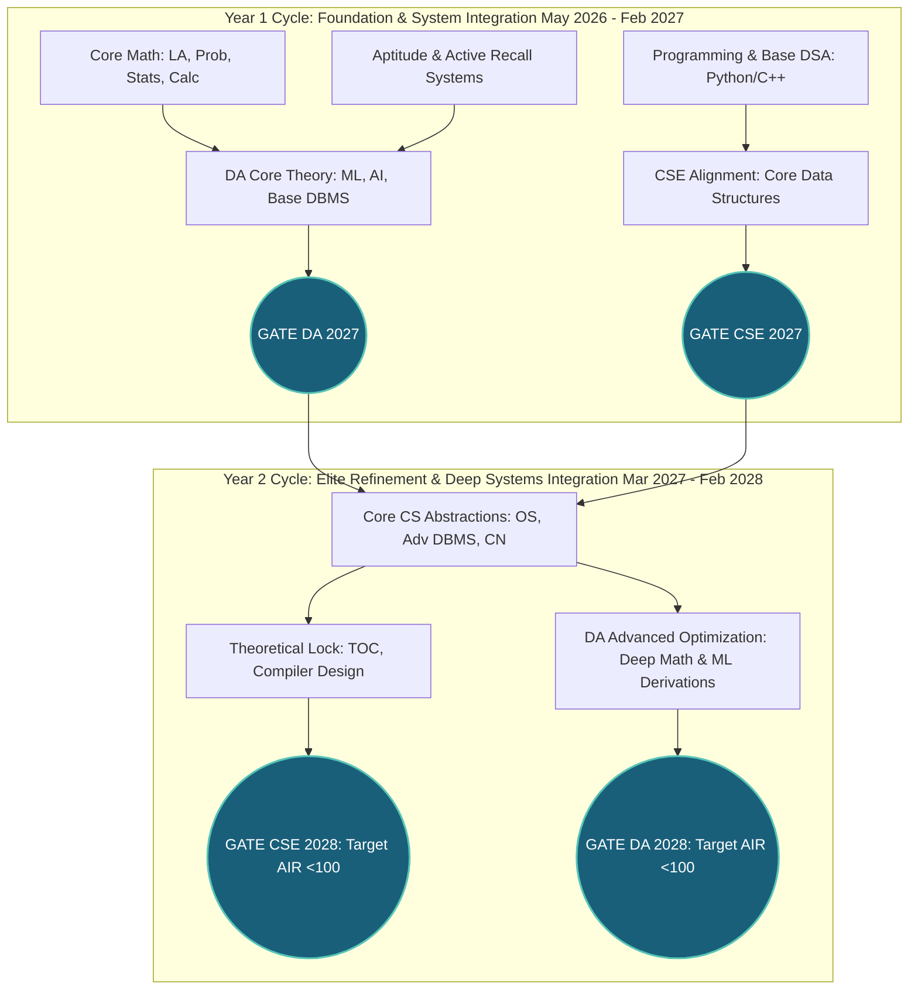

# Master Preparation Strategy: Integrated 4-Target Architecture

## 🎯 Executive Summary & Core Objective

The ultimate objective of this preparation operating system is absolute: Secure an **All India Rank (AIR) under 100** across both data science and computing streams by executing an optimal dual-cycle progression strategy:
1. **GATE Data Science & Artificial Intelligence (DA) 2027** — Foundation + Serious Competitive Attempt
2. **GATE Computer Science & Information Technology (CSE) 2027** — Foundation Alignment + Real-Paper Exposure
3. **GATE Data Science & Artificial Intelligence (DA) 2028** — AIR <100 Peak Optimization Attempt
4. **GATE Computer Science & Information Technology (CSE) 2028** — AIR <100 Terminal Refinement Attempt

This strategy structures preparation for a busy **Electronics and Communication Engineering (ECE)** graduate working full-time. It capitalizes heavily on mathematical maturity while systematically building core computer science concepts using a strict **Book-First** active recall approach.

---

## 🏛️ The Dual-Stream, Dual-Cycle Macro Architecture

Preparing for two overlapping streams across two cycles requires an intelligent cascade. Instead of treating the four attempts as independent silos, we organize them as an interconnected evolutionary tree.

### Evolutionary Progression Matrix

| Attempt Milestone | Primary Strategic Role | Pacing & Focus Strategy | Target Competency & Expected Outcomes |
| :--- | :--- | :--- | :--- |
| **GATE DA 2027** | Foundation & First Serious Attempt | Heavy core mastery of Math, ML, AI, and SQL. Building initial layered notes and mock routines. | Securing strong positive rank, building absolute test temperament, and mastering standard question types. |
| **GATE CSE 2027** | Exposure & Overlap Benchmarking | Taking the paper using shared foundational skills (Math, Aptitude, Programming, Base DSA, basic DBMS). | Eliminating paper-day surprise, testing pure problem-solving reflexes, and mapping gaps for Year 2. |
| **GATE DA 2028** | Peak Rank Optimization Attempt | Hyper-focused PYQ drills, advanced statistical derivations, speed/accuracy locks, and error extinction. | **Target AIR under 100.** Compounding Year 1 assets into ultra-short memory sheets. |
| **GATE CSE 2028** | Terminal Mastery Attempt | Deep coverage of Core Systems (OS/CN) and Theoretical CS (TOC/CD). Advanced mock simulation sweeps. | **Target AIR under 100.** Flawless conceptual depth and high-speed execution. |

---

## 🧠 ECE to CSE/DA Transition: Exploiting the Profile

Transitioning from continuous physical systems (circuits, signals, electromagnetics) to discrete computing logic requires explicit adaptation.

### 1. Mindset Shifts: Continuous vs. Discrete Logic
- **ECE Paradigm:** Analyzes continuous wave spaces, noise boundaries, Fourier series, and physical component limits.
- **CS/DA Paradigm:** Operates on finite memory models, absolute discrete states, algorithmic determinism, and multidimensional optimization surfaces.
- **Strategic Pivot:** Treat data structures as static registers or memory buffers (conceptually identical to hardware controllers). View machine learning algorithms as automated mathematical signal filters.

### 2. Capitalizing on Mathematical Maturity
Your B.Tech in ECE provides an immense competitive head start over candidates without an advanced engineering math background.
- **Linear Algebra:** Vector spaces, transformations, eigenvalues, and SVD are intuitive elements from signal processing.
- **Probability & Statistics:** Random variables, Gaussian distributions, and Bayes' metrics map directly to your communication systems coursework.
- **Execution Target:** Aim for **100% accuracy** in the DA/CSE Mathematics sections. Use this high-scoring certainty to cushion the initial ramp-up period for pure CS systems.

### 3. Bridging the Programming Gaps
- Avoid over-architecting local IDE setups with excessive toolchains.
- Focus on writing clean, modular pseudocode on paper.
- Understand **pointers as exact memory addresses** (leveraging microprocessors exposure) and **recursion as deterministic stack frame allocations**.

---

## 📖 The Book-First & Written-Media Dominance Policy

We completely eliminate reliance on long, passive video lectures. Passive viewing creates an illusion of competence while degrading active synthesis.

### Why Books & PDFs Win for This Candidate:
1. **Speed of Traversal:** Reading top-tier standard texts allows concept ingestion at **3x to 5x the speed** of spoken lecture audio.
2. **Active Annotation:** Enables immediate underlining, margin summarizing, and instant cross-referencing.
3. **Commute Alignment:** Reading highly structured PDFs or printed note sheets requires zero connectivity, low device battery, and works smoothly during transit noise.

### Strict Resource Discovery Hierarchy
For every subject module, proceed strictly through this sequence:

---

## 🛡️ Core Operating Tenets

### Tenet I: Radical Consistency Over Intensity
Studying 14 hours on a Sunday followed by complete inaction during the week breaks continuous neural loading. You adhere to a balanced weekly baseline: **1 focused weekday desk hour + 2 travel revision hours + structured weekend blocks.** This yields **~28-32 high-yield study hours weekly**.

### Tenet II: Spaced Repetition Integration
Memory retention decays exponentially without retrieval friction. The system schedules automated **1-day, 7-day, 21-day, and monthly active recall loops** directly into your study planner.

### Tenet III: Real Exam Friction From Day One
Past Year Questions (PYQs) are integrated as primary learning materials, not end-of-subject testing material. You parse topic-level PYQs immediately after reading the core text to calibrate your analytical depth to official exam standards.

### Tenet IV: Asynchronous Commute Decoupling
Your 2 hours of weekday commute must remain protected from complex analytical problem-solving. Tracing deep recursion trees or memory locks on a crowded train causes fatigue. Travel time is reserved exclusively for **low-energy maintenance**: reviewing spaced repetition summary PDFs, flashcards, error records, and formula mappings.
