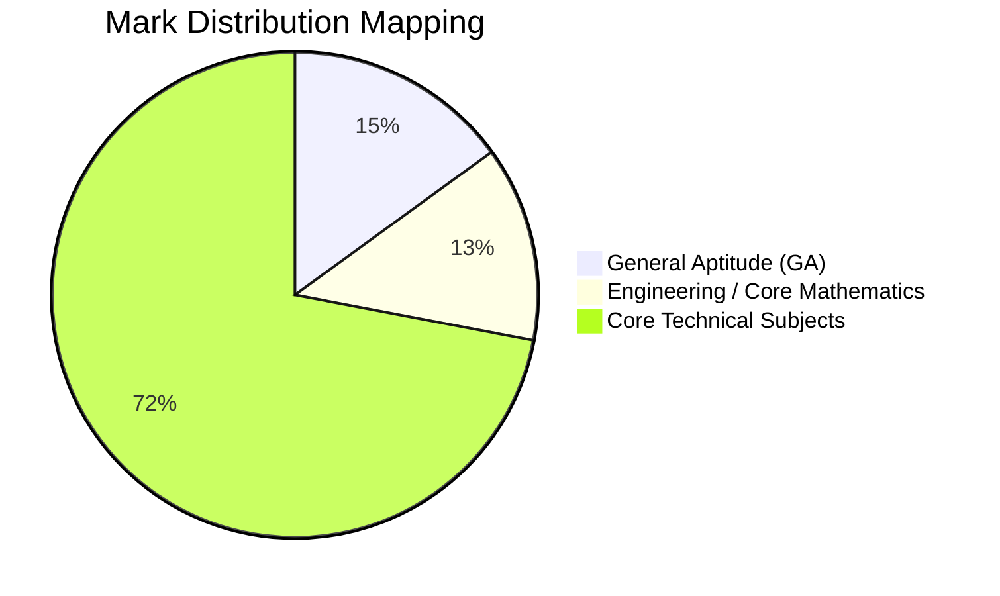
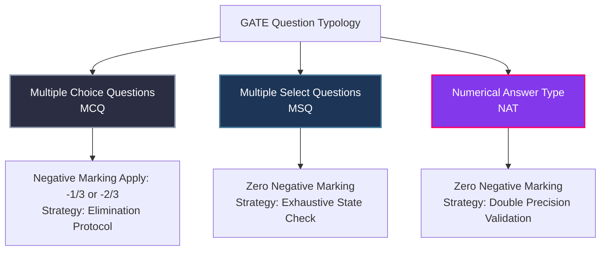

# Exam Structural Analysis: GATE DA & CSE (2027 & 2028)

To achieve an **All India Rank (AIR) under 100**, the GATE examination must be approached as a highly deterministic system with strict mathematical and structural constraints. Understanding the scoring anatomy allows proportional time allocation to high-yield modules across both exam cycles.

---

## 📊 Structural Anatomy of the GATE Paper

Both GATE DA and GATE CSE follow an identical baseline layout:
- **Total Duration:** 180 Minutes (3 Hours)
- **Total Questions:** 65 Questions
- **Total Marks:** 100 Marks

### Sectional Breakdown

---

## 🔍 Detailed Syllabus Comparison & Weightage Analysis

### 1. GATE Data Science & AI (DA) Syllabus Weightage (Expected)

| Subject Module | Core Focus Areas | Expected Weightage | Priority Tier |
| :--- | :--- | :--- | :--- |
| **Probability & Statistics** | Permutations, Combinations, Bayes' Theorem, Distributions (Normal, Poisson, Binomial), Hypothesis Testing, Z/T/Chi-square tests | **18 - 22 Marks** | **Critical Engine** |
| **Linear Algebra & Calc** | Vector spaces, SVD, Eigenvalues, Matrix decomposition, Partial derivatives, Optimization gradients | **12 - 15 Marks** | **Critical Engine** |
| **Machine Learning** | Supervised/Unsupervised learning, Regression, Classification, Clustering, K-Means, SVM, Neural Networks basics | **15 - 18 Marks** | **High Yield** |
| **Data Structures & Algo** | Arrays, Stacks, Queues, Trees, Search/Sort algorithms, Time/Space Complexity | **10 - 12 Marks** | **Medium Yield** |
| **Database Management** | ER-models, Relational Algebra, SQL queries, simple Indexing | **8 - 10 Marks** | **Medium Yield** |
| **Artificial Intelligence** | Search heuristics (A*), Logic programming, Knowledge representation | **6 - 8 Marks** | **Targeted Yield** |
| **Programming (Python)** | Data structures manipulation, logic translation, basic file handling | **5 - 7 Marks** | **Foundational** |
| **General Aptitude** | Numerical, Verbal, Spatial, and Analytical reasoning | **15 Marks** | **Mandatory Lock** |

### 2. GATE Computer Science (CSE) Syllabus Weightage (Historical & Expected)

| Subject Module | Core Focus Areas | Expected Weightage | Priority Tier |
| :--- | :--- | :--- | :--- |
| **Data Structures & Algo** | Trees, Graphs, Hashing, Dynamic Programming, Greedy, Divide & Conquer | **12 - 15 Marks** | **Core Foundation** |
| **Discrete Mathematics** | Propositional Logic, Sets, Relations, Graphs, Combinatorics | **8 - 10 Marks** | **Core Foundation** |
| **Operating Systems** | Processes, Threads, Concurrency, Semaphores, Paging, Virtual Memory | **8 - 11 Marks** | **Heavy Concept** |
| **Database Management** | Transactions, Concurrency Control, Serializability, Normalization, B+ Trees | **7 - 9 Marks** | **High Scoring** |
| **Computer Networks** | ISO/OSI Stack, TCP/UDP, Routing (OSPF/BGP), Sliding Window, IP Addressing | **8 - 11 Marks** | **Heavy Breadth** |
| **Theory of Computation** | DFAs, NFAs, Context-Free Grammars, Turing Machines, Decidability | **8 - 10 Marks** | **Highly Deterministic** |
| **Compiler Design** | Lexical Analysis, Parsing (LL/LR), Syntax-Directed Translation, Liveness | **4 - 6 Marks** | **High ROI** |
| **Digital Logic** | Boolean Algebra, Combinational/Sequential Circuits, Minimization | **4 - 6 Marks** | **ECE Advantage** |
| **Comp. Org. & Arch (COA)**| Pipelining, Cache Memory mapping, Instruction execution buffers | **6 - 8 Marks** | **Tough / Time Sink** |
| **Engg. Math & Aptitude** | Calculus, Linear Algebra, General Aptitude | **18 - 20 Marks** | **Mandatory Lock** |

---

## 🎯 Target Accuracy Metrics Across Four Milestones

Securing a top-100 rank leaves zero margin for unforced errors. You are competing against candidates with total theoretical coverage; the defining differentiator is **emotional control and execution precision under stress**.

### Target Score Matrix

| Target Stream & Year | Primary Strategic Role | Target Score Range | Expected Rank Range | Required Attempt Ratio | Max Permissible Errors |
| :--- | :--- | :--- | :--- | :--- | :--- |
| **GATE DA 2027** | Primary Serious Competitive Attempt | **78 - 85 / 100** | **AIR 1 - 50** | **90% - 95%** (58-62 Qs) | **3 - 4 Incorrect Questions** |
| **GATE CSE 2027** | Foundation Alignment & Exposure Attempt | **50 - 60 / 100** | **Top 1500 - 2500** | **70% - 75%** (45-50 Qs) | **6 - 8 Incorrect Questions** |
| **GATE DA 2028** | Peak AIR <100 Optimization Attempt | **82 - 88 / 100** | **AIR 1 - 20** | **92% - 97%** (60-63 Qs) | **2 - 3 Incorrect Questions** |
| **GATE CSE 2028** | Terminal AIR <100 Mastery Attempt | **75 - 82 / 100** | **AIR 1 - 50** | **88% - 94%** (57-61 Qs) | **3 - 4 Incorrect Questions** |

---

## 🧩 Question Typology & Tactical Execution

GATE deploys three distinct variants of questions to test conceptual resilience. Each requires a dedicated operational protocol.

### 1. Multiple Choice Questions (MCQs)
- **Mechanics:** 4 options, exactly 1 correct. Carries negative marking (-0.33 for 1-mark, -0.66 for 2-mark).
- **The Pitfall:** Premature selection. Examiners design distractor options matching common calculation errors.
- **Execution Protocol:** **The Two-Pass Rule.** Read all four options before marking. If stuck, invert the problem: prove why three options are mathematically impossible rather than directly solving for the correct one.

### 2. Multiple Select Questions (MSQs)
- **Mechanics:** 4 options, one or more can be correct. **No partial credit. No negative marking.**
- **The Pitfall:** Treating them as MCQs. Candidates find one correct option and move on, or guess wildly due to zero penalty.
- **Execution Protocol:** Treat every single option as an independent **True/False statement**. Evaluate each state in absolute isolation. MSQs test deep theoretical boundaries (e.g., specific edge cases in DBMS serializability schedules or TOC closure properties).

### 3. Numerical Answer Type (NATs)
- **Mechanics:** Enter a real number via virtual keypad. **No negative marking.**
- **The Pitfall:** Interface entry errors, rounding mistakes, and unit conversions (e.g., calculating in bits but the question asks for bytes, or entering speed in Gbps instead of MBps).
- **Execution Protocol:** 
  - Keep your scribble pad highly structured. Box intermediate output values.
  - Check the required rounding precision explicitly (*"round off to 2 decimal places"*).
  - Perform calculations twice using alternate logical paths if time permits.

---

## 🛑 Critical System Traps to Avoid

1. **The COA Time-Sink Trap (CSE):** Computer Organization and Architecture contains deeply complex pipelining and caching hazard problems. Spending 80 hours mastering minor edge cases for 6 marks is a negative ROI play. Prioritize Core Math, DSA, OS, and DBMS.
2. **Underestimating DA Statistics Depth:** DA math explores statistics much deeper than typical engineering math. Master continuous distributions, conditional expectations, and hypothesis testing mechanics directly from primary texts, avoiding shallow summary sheets.
