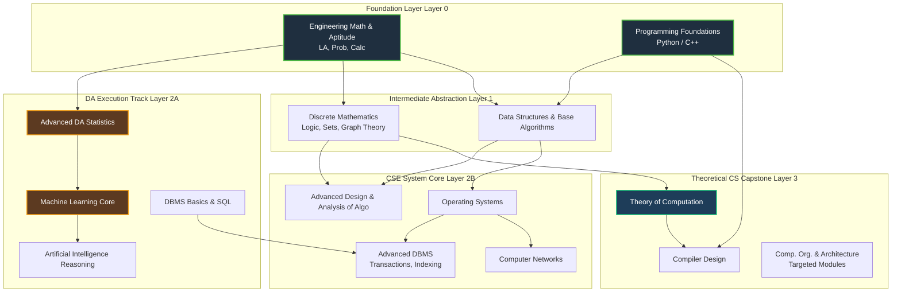

# Subject Priority & Sequencing Architecture

To secure an **All India Rank (AIR) under 100** across both data science and computing streams while balancing a full-time weekday job, your subject sequencing must strictly respect **cognitive prerequisites**. Learning dependent subjects out of order creates mental friction, destroys reading velocity, and causes unnecessary reliance on time-consuming fallback videos.

---

## 🔗 The Global Subject Dependency Graph

Every subject in advanced computing builds upon foundational mathematical and structural layers. You cannot design complex DBMS transaction schedules without understanding OS process synchronization, and you cannot analyze algorithms without discrete mathematical maturity.

---

## 📈 Multi-Phase Sequencing Logic Across Four Milestones

### Phase I: The Shared Foundation Launchpad (May 2026 - Nov 2026)
**Core Objectives:** Build unshakeable mathematical dominance and establish baseline coding fluency to support both 2027 exam targets.
- **Why Start Here:** As an ECE graduate, your immediate psychological and scoring win comes from engineering math. Solving vector spaces, calculus, and probability natively gives you immediate confidence.
- **The Catch-up Factor:** You simultaneously begin **Book-First** reading of Programming Foundations to learn iteration, pointers, and memory layout.
- **Syllabus Covered:** LA, Probability, Calculus, Aptitude, Python/C++ Basics, Core DSA (Arrays, Stacks, Queues, simple Binary Trees).

### Phase II: The GATE 2027 Dual Attempt Pivot (Dec 2026 - Feb 2027)
**Core Objectives:** Lock down the DA scoring engine for an elite competitive attempt while taking CSE to baseline your cross-stream reflexes.
- **Target Milestones:** **GATE DA 2027** (Serious Attempt) and **GATE CSE 2027** (Exposure Attempt).
- **Sequencing:** Advanced Statistics $\rightarrow$ Machine Learning Core $\rightarrow$ SQL/Relational DBMS $\rightarrow$ AI Search Heuristics.
- **Parked Modules:** Concurrency control, Advanced OS, Computer Networks, and pure Automata theory are parked to prevent conceptual distraction.

### Phase III: The Core CSE Deep Systems Architecture (March 2027 - August 2027)
**Core Objectives:** Transition from pure data manipulation to deep system-level abstractions to launch the Year 2 master progression.
- **Sequencing:** Discrete Mathematics $\rightarrow$ Advanced Algorithms $\rightarrow$ Operating Systems $\rightarrow$ Advanced DBMS $\rightarrow$ Computer Networks.
- **The Cross-Pollination:** Deep exposure to tree arrays and search heuristics in DA directly accelerates comprehension of Graph Algorithms and Indexing structures (B/B+ Trees) in DBMS.

### Phase IV: Theoretical Lock & Final AIR <100 Refinement (September 2027 - January 2028)
**Core Objectives:** Master deterministic automata theory, execute advanced ML mathematical derivations, and eliminate residual technical debt across both tracks.
- **Target Milestones:** **GATE DA 2028** (Peak Optimization Attempt) and **GATE CSE 2028** (Terminal Refinement Attempt).
- **Sequencing:** Theory of Computation (TOC) $\rightarrow$ Compiler Design (CD) $\rightarrow$ Targeted COA $\rightarrow$ Deep DA/ML Refinement Sweeps.
- **Why TOC/CD Last:** These subjects are highly deterministic, logical, and fast to revise. Mastering them late ensures maximum retention leading directly into the terminal exam window.

---

## 🏆 Subject ROI Matrix & Effort Allocation

Not all subjects reward preparation time equally. Allocate your finite deep-work weekday hours according to this Return-on-Investment hierarchy.

| Subject Domain | Required Depth | Complexity / Friction | Expected Marks | ROI Classification | Recommended Ingestion Medium |
| :--- | :--- | :--- | :--- | :--- | :--- |
| **Engineering Math** | Extreme | Low (ECE Advantage) | **13 - 15** | **Ultra High** | Standard reference textbook + Problem sheets |
| **General Aptitude** | High | Low | **15** | **Ultra High** | PYQ extraction sheets + Daily 15-min flashcards |
| **Data Structures** | Extreme | Medium | **10 - 12** | **High** | Textbook tracing + Paper coding routines |
| **DBMS** | High | Low to Medium | **8 - 10** | **High** | Concise theory sheets + SQL practice docs |
| **Compiler Design** | Medium | Low | **4 - 6** | **High** | Standard short notes + Immediate PYQ maps |
| **Operating Systems** | High | High | **8 - 11** | **Medium** | Primary textbook (Silberschatz) + Margin notes |
| **Computer Networks** | Medium | High (Heavy Breadth) | **8 - 11** | **Medium** | PDF summary notes + Selective protocol reading |
| **COA** | Selective | Extreme | **6 - 8** | **Low** | Strictly targeted PDF summaries (Cache/Pipeline) |

---

## 🛑 Sequencing Traps: What NEVER to Do

1. **Studying Algorithms Before Discrete Math:** Attempting to understand asymptotic notation, recurrence relations, or graph traversals without formal exposure to sets, relations, and mathematical proof techniques leads to shallow memorization.
2. **Studying Compiler Design Before TOC:** Compiler parsing algorithms (LL/LR) are direct practical applications of Context-Free Grammars and pushdown automata from TOC. Reversing this sequence guarantees conceptual gridlock.
3. **Attempting Deep COA Early:** COA acts as a massive psychological filter. Spending months reading deep computer architecture early in preparation will derail your schedule and trigger burnout. Defer it until your core scoring systems are robust.
