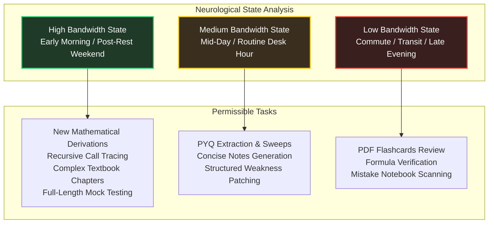
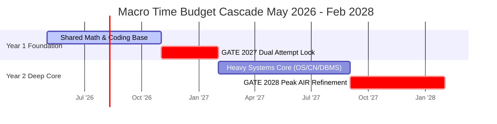

# Time & Energy Management Architecture

To prepare for four distinct examination milestones across two years while managing full-time weekday professional commitments, standard time-blocking is insufficient. You must master **Cognitive Energy Budgeting**. Deep neural exhaustion is real; attempting complex mathematical derivations or systems architecture tracing when glucose and dopamine levels are depleted leads directly to frustration and schedule abandonment.

---

## 🔋 Cognitive Energy Mapping

Your brain operates in distinct neurological states throughout the day. The **Master Time Management System** maps study task complexity directly onto your available biological bandwidth.

---

## 🛡️ Context Switching Protection

Transitioning from your day-to-day corporate engineering context to the rigorous GATE theoretical framework carries a high cognitive switching cost. Without an explicit buffering protocol, work-related friction will bleed directly into your **1-hour deep work desk block**.

### The 3-Phase State Decompression Routine
1. **The Physical Hard Stop:** Shut down professional workstations exactly 15 minutes before your scheduled deep study block. Move to a dedicated, decoupled physical space (even a separate desk corner or table).
2. **The 5-Minute Cleansing Reset:** Execute structured box breathing (4s inhale, 4s hold, 4s exhale, 4s hold) to down-regulate your central nervous system.
3. **The Micro-Win Ignition:** Open your study session by reviewing exactly **3 previously solved PYQs** or a highly familiar formula mapping sheet. This triggers immediate competence loops and overrides the limbic resistance of starting a complex new abstraction.

---

## 🔀 Managing Split Preparation Routines Across Four Targets

Because you are tracking both DA and CSE streams across 2027 and 2028 cycles, your focus allocation must shift dynamically based on absolute proximity to registration and exam windows.

### Macro Time Budgeting Lifecycle

### The Weekly 80/20 Buffer Allocation Strategy
Never schedule 100% of your raw available hours. If your commute spans 2 hours daily, budget exactly **1.5 hours of usable passive time**. If your weekend provides 24 total waking hours, budget exactly **16 hours of focused execution**. The remaining reserve acts as a crucial heat-sink to absorb life friction, unexpected professional tasks, travel fatigue, and schedule drift without causing cascading failures.

---

## 📋 The Execution Matrix: High Friction vs. Low Friction

| Execution Vector | Permissible Activities | Prohibited Activities | Optimal Medium |
| :--- | :--- | :--- | :--- |
| **Desk Deep Work** (1 Hr Weekdays / Weekends) | Formal derivations, recursive stack frame tracing, primary textbook reading, full-length mock testing | Passive browsing, checking messaging apps, unannotated continuous reading | Hardcover Book, A4 Scribble Sheets |
| **Active Commute** (2 Hrs Daily Transit) | Spaced repetition flashcard reviews, scanning short-note PDFs, mistake database reinforcement | Tracing complex graphs, attempting raw NAT calculations, video bingeing | Smartphone / E-Ink Tablet (Offline PDFs) |
| **Recovery Buffers** (Scheduled Downtime) | Walk without electronic devices, deep physical hydration, unstructured reflection | Guilt-driven revision, forcing unplanned extra mock sweeps | Absolute Silence |

---

## 🛑 Critical System Traps

1. **The Multitasking Illusion:** Trying to listen to an algorithmic audio explanation while processing a professional email guarantees zero semantic assimilation of the logic. **Strict monotasking is mandatory.**
2. **Revenge Bedtime Procrastination:** Sacrificing sleep cycles to recover missed study hours destroys your executive prefrontal functioning for the subsequent 48 hours. A fatigued brain cannot build abstraction layers. Always prioritize your baseline **7-hour recovery sleep**.
