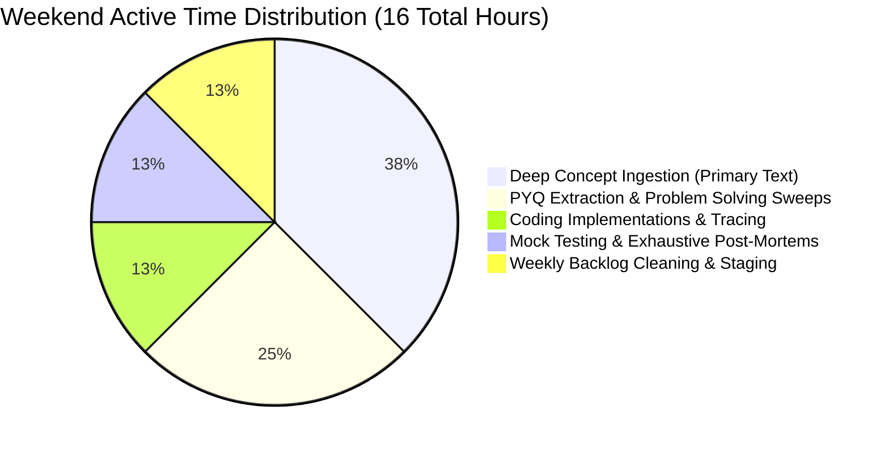

# Weekend Execution System: The Heavy Synthesis Engine

While weekdays maintain structural momentum through focused micro-blocks, weekends represent the foundational engine where deep conceptual mastery and complex problem-solving dominance are engineered. You have **Full Saturday** and **Full Sunday** dedicated to this operating system. To prevent cognitive exhaustion across a rigorous two-year trajectory spanning four examination targets, you must never execute unstructured study marathons.

This strategy provides an **Hour-by-Hour Ideal Weekend Template** balancing deep technical synthesis blocks, coding implementations, sectional mock testing, backlog compression, and absolute biological recovery.

---

## 🏛️ Weekend Macro Structural Allocation

A total of 48 hours per weekend provides exactly **16 hours of ultra-high-focus technical execution**. The remaining hours are strictly protected for physiological sleep, nutritional loading, active walking buffers, and central nervous system decompression.

---

## ⏱️ Hour-by-Hour Ideal Weekend Blueprint

This template mirrors the biological rhythms required to optimize complex mathematical and algorithmic problem-solving capability.

```mermaid
gantt
    title Ideal Saturday / Sunday Execution Architecture
    dateFormat  HH:mm
    axisFormat %H:%H

    section Block I: Deep
    Primary Synthesis & Proofs      :crit, 07:00, 10:30

    section Recovery A
    Physical Decompression Buffer   :10:30, 11:30

    section Block II: Solve
    PYQ Extraction & Problem Tracing:active, 11:30, 14:00

    section Recovery B
    Nutritional Loading & Rest      :14:00, 15:30

    section Block III: Code/Test
    Implementations / Simulation    :15:30, 18:30

    section Block IV: Prep
    Weekly Pipeline Staging Lock    :19:30, 21:00
```

---

## 🗓️ Detailed Execution Protocol

### Block I: Deep Concept Ingestion (07:00 - 10:30)
*Target: Complex Textbooks, Mathematical Derivations, Core Systems Architecture*
- **07:00 - 08:30 (Session A):** Deep parsing of core chapters (e.g., standard Operating Systems process scheduling or Compiler parsing algorithms). Read with pen in hand. Draw state machines and recursion trees directly on paper.
- **08:30 - 08:45:** Stand up. Hydrate. Zero screen access.
- **08:45 - 10:30 (Session B):** Continue reading and compile **Layered Short Notes** directly from the core texts processed in Session A.

### Block II: Problem Solving & PYQ Validation (11:30 - 14:00)
*Target: Translating Theory to Immediate GATE Constraints*
- **11:30 - 13:00 (Structured PYQ Parsing):** Solve every available Past Year Question for the exact chapter module finished in Block I. **Rule: Time yourself.** Enforce a maximum boundary of 3 minutes per 2-mark question.
- **13:00 - 14:00 (Defect Mapping & Edge Case Logging):** Mark incorrect attempts immediately. Extract root-cause logic directly into your **Error Log System** repository.

### Block III: Execution Mechanics & Testing (15:30 - 18:30)
*Target: Active Recall Tracing, Sectional Tests, and Systems Simulation*
- **Saturday Variant (Coding Implementation):** Write modular procedural code for recursive backtracking, binary search tree operations, or sliding window protocols. Execute trace tables on paper first, then validate locally in a clean Python/C++ terminal environment.
- **Sunday Variant (Sectional Test & Post-Mortem):** Execute a 45-minute structured topic test or a 90-minute sectional mock test under absolute simulated exam isolation. Spend the remaining 90 minutes performing an exhaustive **Question-by-Question Post-Mortem**.

### Block IV: Administrative Buffer & Pipeline Staging (19:30 - 21:00)
*Target: Backlog Cleaning & Setup Lock for the Upcoming Week*
- **19:30 - 20:30 (Debt Collection):** Inspect your backlog tracking log. If any weekday micro-sessions were missed due to professional demands, resolve the pending flashcard or short-note compilation queue immediately.
- **20:30 - 21:00 (Commute Pre-Loading):** Export generated short notes to clean, mobile-optimized PDFs. Sync offline flashcard packages to your transit device. Stage your physical desk for Monday morning.

---

## 🔄 Strategic Shifts: Year 1 vs. Year 2 Weekends

### Year 1 Weekends (Targeting GATE DA & CSE 2027)
- Focus heavily on establishing baseline conceptual depth. Block I is dominated by standard textbooks to bridge the ECE-to-CSE abstraction gaps (Linear Algebra, pure Stats, Python logic, core Data Structures).
- Mock testing is bounded primarily to sectionals and topic-level validations to build absolute confidence without early demoralization.

### Year 2 Weekends (Targeting GATE DA & CSE 2028 AIR <100 Refinement)
- Block I shifts from primary reading to highly compressed advanced analytical sweeps, deep mathematical proofs, and complex edge-case elimination.
- Block III on Sundays transitions directly into **Full-Length Mock Simulations** starting early in the cycle, paired with intense multi-hour defect extinction workflows.

---

## 🔄 Subject Rotation Strategy

To prevent single-subject cognitive fatigue, deploy a **Dual-Track Allocation Engine** across weekend blocks:
- **Track A (Morning Blocks):** Highly abstract, math-heavy modules (Linear Algebra, Probability/Statistics, Advanced Algorithms Mastery).
- **Track B (Afternoon Blocks):** Highly structural, diagram-heavy modules (DBMS Relational schemas, Computer Networks protocol analysis, Compiler syntax structures).

---

## 🛑 Critical System Traps

1. **The Overtime Trap:** Refuse to study past 21:30 on Sunday evenings. Pushing deep-work synthesis into Sunday night guarantees a sleep-deprived Monday morning desk session, triggering a cascading study debt failure across the entire upcoming week.
2. **Unstructured Browsing During Breaks:** Using your 10:30 recovery buffer to watch videos or scroll news feeds completely invalidates your neurological cleanup. Your prefrontal cortex continues to consume metabolic bandwidth. **Rest must consist of absolute silence or passive physical movement.**
