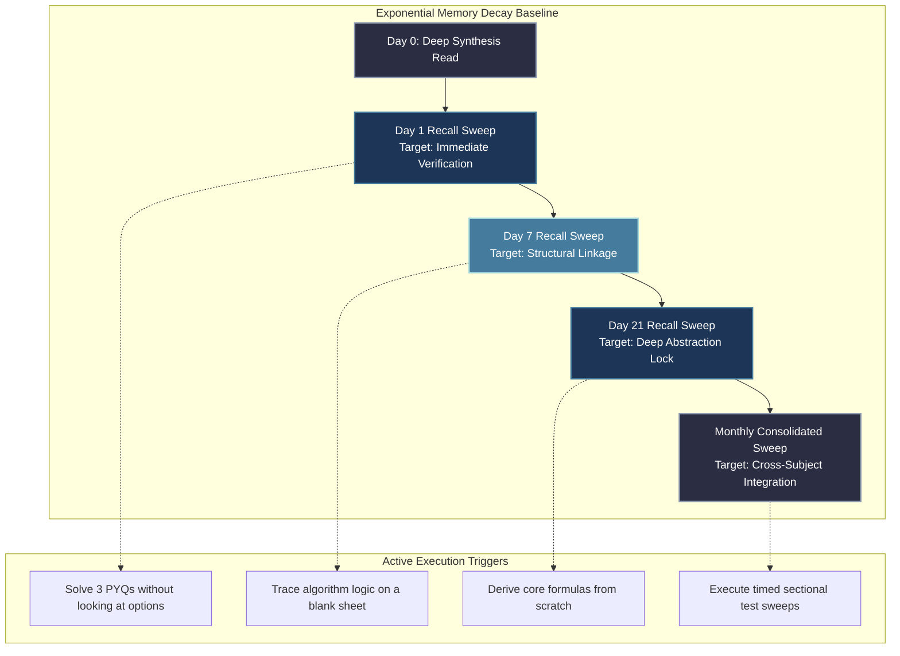

# Revision Engine Architecture: Spaced Repetition & Active Recall

To conquer the massive theoretical breadth of two overlapping GATE syllabi across two preparation cycles (2027 and 2028), standard reading-based revision is a fatal strategy. Passive re-reading creates **fluency illusions**—your brain recognizes the font and page layout, tricking your prefrontal cortex into believing you possess deep operational synthesis of the underlying mathematics.

This operating system replaces passive review with an **Automated Spaced Repetition Engine** powered exclusively by **Active Recall**.

---

## 🧠 The Forgetting Curve & Retention Mechanics

Without active intervention, technical comprehension drops to ~20% within 30 days of initial ingestion. By injecting precise cognitive retrieval friction at mathematically optimized intervals, we flatten the exponential decay curve to maintain a constant **90%+ operational state retention** across all four targeted attempts.

---

## ⏱️ The Multi-Tier Spaced Repetition Cascade

Your study calendar automatically triggers four distinct review vectors for every completed module.

### 1. The 1-Day Verification Loop (Micro-Validation)
- **When:** Next morning's Desk Deep Work Block (first 5 minutes) or Morning Forward Commute.
- **Execution Mechanism:** Answer exactly **3 direct conceptual flashcards** or solve **2 direct numerical applications** without opening the source notes.
- **Goal:** Verify that short-term working memory successfully consolidated into intermediate cache storage overnight.

### 2. The 7-Day Structural Loop (Linkage Sweep)
- **When:** Sunday evening Administrative Buffer block.
- **Execution Mechanism:** Look at the **Topic Header** only. On a blank sheet of paper, draw the absolute system block diagram or write out core mathematical assumptions from scratch.
- **Goal:** Prevent isolated facts from drifting. Force the brain to actively rebuild structural pathways connecting cross-module dependencies.

### 3. The 21-Day Deep Abstraction Loop (Stress Validation)
- **When:** Integrated into alternate weekend practice blocks.
- **Execution Mechanism:** Extract **5 mixed-tier PYQs** from that exact topic module. Solve them under absolute time constraints.
- **Goal:** Stress-test retention under conditions simulating live exam fatigue. Identify if any core foundational assumptions have mutated or degraded over time.

### 4. The Monthly Consolidated Sweep (Macro Integration)
- **When:** Last weekend of every calendar month.
- **Execution Mechanism:** Execute a **45-minute multi-topic sectional test** spanning all subjects covered in the preceding 60 days.
- **Goal:** Build context-switching endurance. Train the brain to jump instantly from an Operating Systems page replacement mechanism to an advanced Statistics probability density distribution.

---

## 🔄 Lifecycle Progression: Revision in Year 1 vs. Year 2

### Year 1 Revision Profile (GATE 2027 Foundations)
- Focuses heavily on raw retention of initial concepts, validating notation, memorizing core syntax, and cementing base mathematical properties. Loops are executed alongside primary book chapters.

### Year 2 Revision Profile (GATE 2028 AIR <100 Peak Optimization)
- Shifts entirely to ultra-fast memory extraction from previously consolidated notes. Since the baseline concept layers are built, the 7-day and 21-day loops consist almost entirely of rapid formula inverse sweeps, complex PYQ sweeps, and multi-track defect extinction validation.

---

## 📝 Active Recall Mechanics vs. Passive Review

| Ingestion Parameter | Passive Review (Prohibited) | Active Recall (Mandatory Engine) |
| :--- | :--- | :--- |
| **Physical Engagement** | Eyes scanning highlighted book text. | Hand writing output states on a blank sheet from memory. |
| **Cognitive Load** | Extremely low. Feels comfortable. | High friction. Feels mentally taxing and demanding. |
| **Defect Discovery** | Hidden until mock test failure occurs. | Real-time exposure of exact broken logic links. |
| **Speed of Session** | Fast surface scan. | Deliberate, highly precise paced execution. |

---

## 🧮 The Formula Validation Engine

For mathematical subjects (Linear Algebra, Calculus, Statistics) and deep engineering logic, rote memorization of final output formulas is highly vulnerable to examiner boundary variations.

### The 3-Step Formula Consolidation Method
1. **Derivation Tracking:** Your formula notebook must never contain just the final output string. It must include a **3-line derivation summary** explaining underlying constraints (e.g., *"Why does Bayes' Theorem use the law of total probability in the denominator?"*).
2. **Dimension & Unit Tagging:** Explicitly box target units next to every formula. Note down exactly when the formula breaks down (*"Valid only for stationary ergodic signal processes"*).
3. **The Inverse Flashcard Sweep:** Create flashcards where the prompt is the final mathematical formula, and your task is to name the exact theorem, its explicit assumptions, and its primary failure edge cases.

---

## 🛑 Critical System Traps

1. **The Highlighting Trap:** Highlighting lines in a textbook does not transfer information to your neocortex. Treat highlighting as a simple visual indexing bookmark, nothing more. **If you cannot write it from memory, you do not know it.**
2. **Skipping Scheduled Loops:** If an unexpected professional crisis forces you to skip a 21-day loop, do not delete the task. Push it into the weekend **Debt Recovery Queue**. Unverified knowledge paths decay rapidly into complete blind spots.
