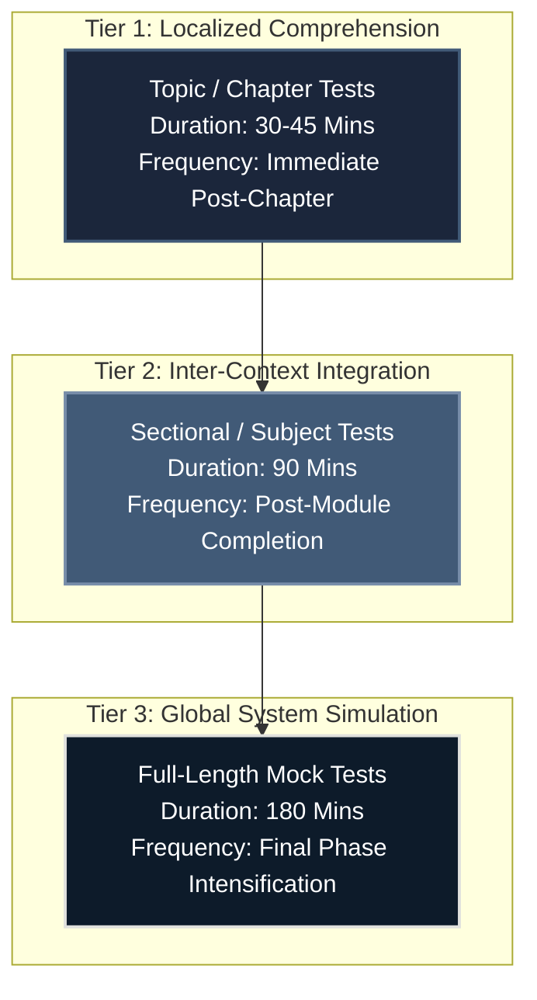
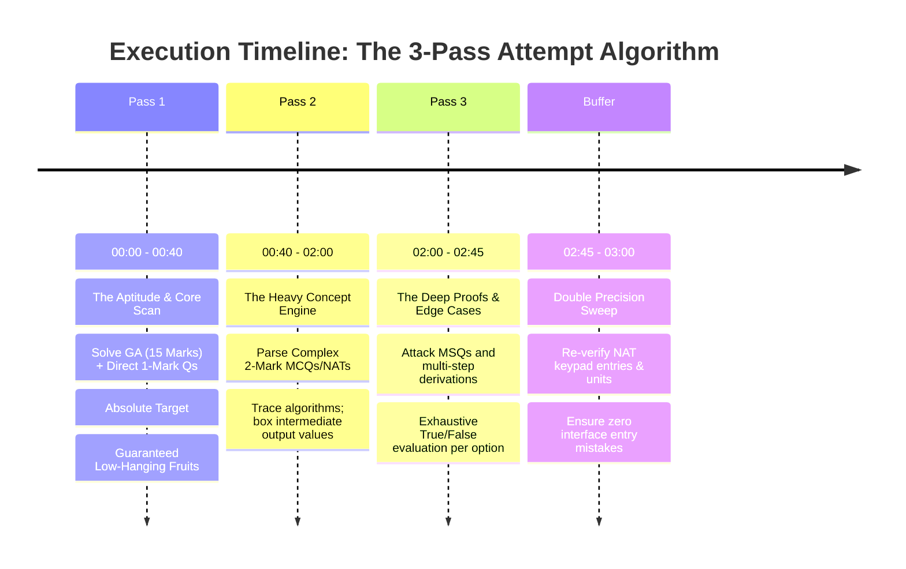

# Mock Test Execution & Optimization Architecture

To achieve an **All India Rank (AIR) under 100** across both streams over two cycles, mock tests must never be treated as passive evaluation or post-study grading tools. They are **active execution environments** designed to stress-test your mathematical stamina, expose brittle conceptual foundations, and train absolute precision under strict 180-minute constraints.

---

## 🏛️ Multi-Tier Testing Ecosystem

Your assessment architecture progresses through three distinct operational tiers, shifting from pure localized comprehension to massive multi-subject global integration.

---

## 🔀 Strategy Evolution Across Four Milestones

### 1. GATE DA 2027 Strategy (Serious First Attempt)
- **Deployment:** Start full-length mock testing early (December 2026). Focus is on building core test stamina, validating basic Python and Statistics mechanics under time pressure, and eliminating baseline unforced computational errors.
- **Goal:** Establish unshakeable rhythm, mapping out the precise layout of the scribble pad and optimizing interface inputs.

### 2. GATE CSE 2027 Strategy (Exposure First Attempt)
- **Deployment:** Treated strictly as a benchmarking test using overlapping foundational capabilities. Full-length test exposure is limited to 2-3 standard test simulations in January 2027 to gauge real-paper friction without derailing focus on the DA scoring engine.
- **Goal:** Experience core CS paper environments, baseline pure problem-solving reflexes, and isolate exact structural gaps required for the Year 2 bridge.

### 3. GATE DA 2028 Strategy (Peak AIR <100 Optimization Attempt)
- **Deployment:** Transition directly to highly advanced mock test variants. Since baseline concepts are fully established, tests are used exclusively to achieve a flawless **>92% attempt ratio** with net negative bleeds approaching absolute zero.
- **Goal:** Master deeply hidden MSQ edge cases and multi-step advanced numerical calculations.

### 4. GATE CSE 2028 Strategy (Terminal AIR <100 Mastery Attempt)
- **Deployment:** High-frequency, dual-track sweeps. Execute two full-length simulated papers weekly starting late November 2027. Pair every attempt with massive, multi-hour analytical Post-Mortems tracking compiler parsing states, advanced database concurrency, and OS caching mappings.
- **Goal:** Absolute speed and technical dominance across highly complex, multi-subject papers.

---

## ⏱️ The 180-Minute Paper Attempt Blueprint (Full-Length Tests)

Never solve a GATE paper linearly from Question 1 to 65. You must deploy an **Asymmetric Multi-Pass Scanning Algorithm** to bank guaranteed marks early and protect your limbic system from anxiety-induced paralysis.

---

## 🔬 Absolute Mistake Categorization Protocol

When reviewing a test, labeling an error simply as a "silly mistake" is an unacceptable analytical failure. Every dropped mark must be traced to its specific root cause and cataloged using the following matrix.

| Error Code | Class Definition | Root Cause Mechanics | Structural Remedy Required |
| :--- | :--- | :--- | :--- |
| **ERR_CONCEPT** | Conceptual Blindspot | Encountered an abstraction layer or theorem exception never read in core material. | Return directly to the **Primary Textbook**. Read the missing section; build short notes. |
| **ERR_CALC** | Execution Precision | Mathematical miscalculation, sign inversion, or calculator virtual keypad dropping digits. | Enforce structured scribble-pad layouts. Box sub-steps. Run mental checks on magnitude. |
| **ERR_PARSE** | Semantic Misinterpretation| Missed critical boundary keywords (*"not"*, *"false"*, *"always"*, *"at least"*). | Trace question strings with your mouse cursor during reading. Underline logical constraints. |
| **ERR_ENTRY** | Interface Transfer | Solving correctly on paper but entering inverted units or incorrect decimal scaling. | Write target units boldly next to your final answer box on the rough pad before typing. |
| **ERR_TIME** | Time-Sink Trap | Spending >8 minutes on a single ego-driven derivation, causing end-of-paper dropouts. | Enforce strict **Hard Disengagements**. If a path fails to yield clarity within 4 minutes, mark for review and exit. |

---

## 📈 Score Improvement Engine & Dashboard Tracking

To monitor your ascent toward the top 100, maintain a highly disciplined offline tracking log recording these critical Key Performance Indicators (KPIs) for every test attempted.

### Required KPI Tracking Columns:
1. **Raw Score:** Absolute marks achieved out of 100.
2. **Attempted Marks Ratio:** Total value of questions attempted. *(Target: >85% for CSE, >90% for DA)*.
3. **Execution Accuracy:** $\frac{\text{Correctly Answered Marks}}{\text{Attempted Marks}} \times 100$. *(Target Baseline: >90%)*.
4. **Negative Bleed:** Total marks lost strictly to negative penalties. *(Target: <3 Marks)*.
5. **Unforced Error Count:** Number of questions dropped due to `ERR_CALC` or `ERR_ENTRY`. *(Target: Absolute Zero)*.

---

## 🛑 Testing Anti-Patterns: What NEVER to Do

1. **Submitting Tests Early:** If you finish a paper in 140 minutes, **do not hit submit.** Sit in absolute silence for the remaining 40 minutes and execute validation sweeps. Train your body and mind to endure the full 180-minute biological sit.
2. **Reviewing Scores Without Deep Analysis:** Spending 3 hours writing a mock test followed by 10 minutes looking at the score distribution is a negative ROI workflow. **The Post-Mortem review must consume at least 50% to 100% of the original test duration.** Trace every single incorrect option back to its root assumption.
