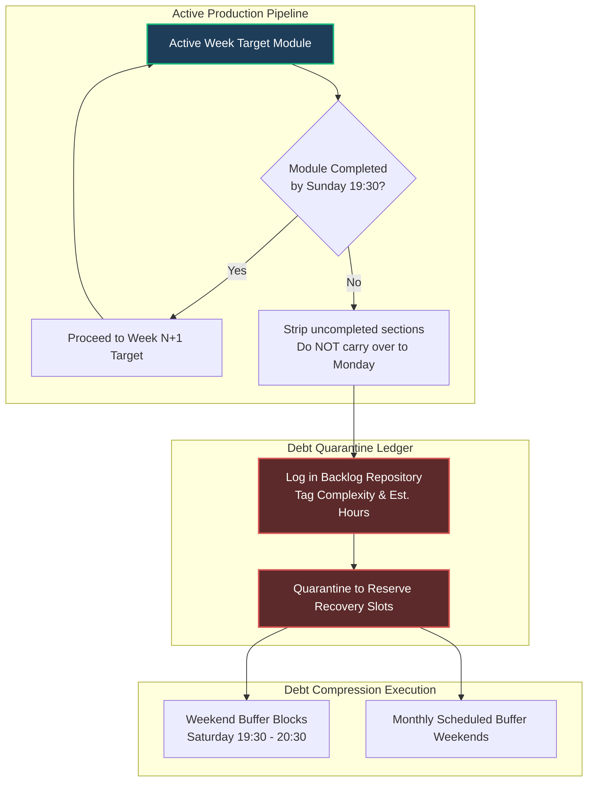
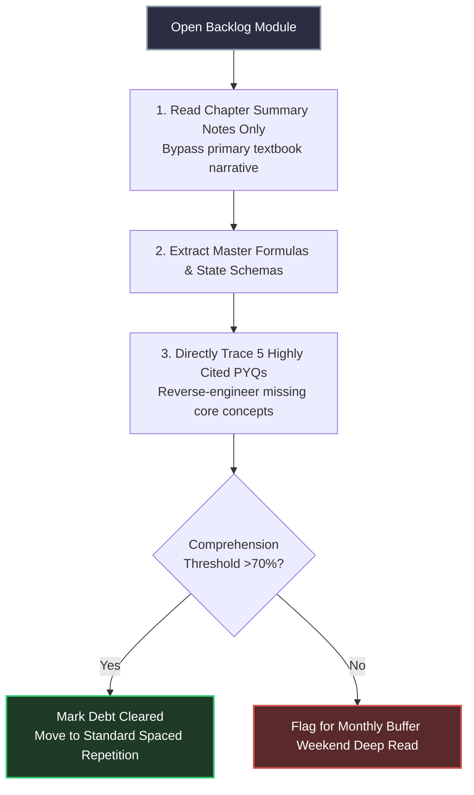

# Backlog Recovery & Debt Compression Systems

In a rigorous two-year preparation architecture tracking four examination targets alongside demanding weekday corporate responsibilities, unforeseen disruptions are mathematically guaranteed. Professional project deliverables, corporate travel overruns, or physical illnesses will inevitably cause missed study modules.

Attempting to resolve study debt by arbitrarily cramming missed hours into an active production week triggers cascading scheduling failures. This operating system establishes a **Regulated Debt Isolation Engine** to quarantine and recover dropped modules systematically.

---

## 🛑 The Core Law of Debt Isolation

**Never compromise the active week's master targets to solve a past backlog.**

If you fall behind on Operating Systems memory allocation during Week 14, and Week 15 is scheduled for DBMS Transactions, you must **instantly transition to DBMS** on Monday morning. The residual OS material is stripped from the active queue and quarantined into the isolated **Backlog Ledger**.

---

## 🗜️ Debt Compression Mechanics: Bounded Recovery

When executing a backlog recovery slot, you cannot afford normal discovery speed. You must deploy **Debt Compression Mechanics** to extract the minimum viable scoring core.

### The 4-Stage Compression Flowchart

---

## 🗓️ Scheduling the Isolation Reserves Across Two Years

To ensure backlog clearing happens without structural bleed, your annual master calendar includes two explicit layers of dedicated buffer capacity tailored for Year 1 vs. Year 2 execution.

### Layer 1: The Micro Reserve (Weekly Execution)
- **Allocation:** Exactly **1 Hour** on Saturday evening (19:30 - 20:30).
- **Target:** Resolving minor weekday slippages (e.g., missed morning Anki decks or short notes left uncompiled due to unexpected early commuting departures).

### Layer 2: The Macro Reserve (Monthly Buffers)
- **Allocation:** The **Final Weekend of every alternating month** contains zero scheduled primary learning.
- **Target:** Heavy, multi-day conceptual deficits. If an entire subject module is abandoned due to extended corporate travel, this 16-hour execution zone is weaponized entirely to read, compile, and validate that singular quarantined module.

---

## 🔀 Evolution: Backlog Recovery in Year 1 vs. Year 2

### Year 1 Backlog Engine (GATE DA & CSE 2027 Baseline)
- Debt recovery prioritizes core fundamental layers. If you fall behind on advanced DA modules (like complex AI search logic), push them to macro reserves while aggressively clearing structural math and programming logic backlogs to safeguard base attempt competitiveness.

### Year 2 Backlog Engine (GATE DA & CSE 2028 AIR <100 Refinement)
- Since core baseline layers are secure, backlogs in Year 2 consist almost entirely of missed mock testing post-mortems or specific deep derivation tasks. Debt compression bypasses basic notes entirely, jumping directly to step 3 (PYQ sweeps and reverse-engineering boundary faults).

---

## 🛡️ Psychological Rescaling Protocols

A mounting backlog creates massive limbic friction, causing candidates to feel overwhelmed and abandon preparation entirely.

### The Triage Protocol
If your Backlog Ledger exceeds **15 estimated hours of uncompleted reading**, execute an immediate hard triage:
1. **Sort by ROI:** Rank pending modules strictly using the **Subject Priority Matrix** ([02_subject_priority.md](./02_subject_priority.md)).
2. **Ruthless Pruning:** Completely strip low-yield peripheral theory (e.g., secondary COA bus architectures or niche Compiler optimization transformations) from the backlog queue. **Accept the zero-mark risk on those specific sub-topics.**
3. **Execute the Core:** Reallocate all reserved buffer capacity strictly to master heavy-scoring primary dependencies (Linear Algebra, pure Stats, Core DSA, OS Concurrency).

---

## 🛑 Critical System Traps

1. **The Catch-up Marathon:** Trying to clear a 12-hour backlog by staying up until 4:00 AM on a weekday destroys circadian stability, resulting in zero deep-work desk focus for the next three days. **Sleep preservation always overrides debt collection.**
2. **Guilt-Driven Multi-Tasking:** Attempting to review backlog short notes while trying to ingest a fresh subject module splits cognitive bandwidth, guaranteeing retention failures across both topics. **Compartmentalization must be absolute.**
