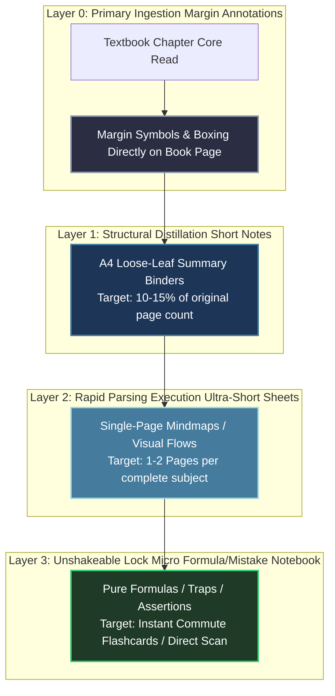

# Note-Making System Architecture: Layered Progressive Compression

Since your preparation methodology strictly enforces a **Book-First** active reading approach, note-making serves as your primary medium of conceptual synthesis. Standard transcription—copying textbook prose line-by-line—is an inefficient administrative waste of focus.

This architecture establishes a **Layered Progressive Compression System** designed to refine massive textual source foundations into high-speed active recall assets over time. Crucially, it details exactly how notes constructed for your initial GATE 2027 attempts evolve into elite competitive revision engines for your terminal GATE 2028 optimization cycle.

---

## 🏛️ The Progressive Note Compression Cascade

Your notes mutate across four distinct physical abstractions over time. Each layer corresponds directly to an advanced retention phase within your **Spaced Repetition Engine** ([06_revision_system.md](./06_revision_system.md)).

---

## 📖 Layer 0: The Margin Annotation Architecture

Never scan a primary textbook page passively. Your pen acts as an active parsing tool.

### Standardized Annotation Glossary
- **`[DEF]`**: Formal definition boundary. Box the core operational parameters immediately.
- **`[!]`**: Mathematical trap or critical theorem boundary (*"Matrix must be positive semi-definite"*).
- **`[PYQ]`**: Underline text directly matching historical GATE distractor options.
- **`[?]`**: Ambiguous logical derivation. Write specific structural questions directly in the white margins.
- **`--> Link: Pg. X`**: Direct concept cross-referencing. Map overlapping data streams instantly.

---

## 📄 Layer 1: Short Notes Compilation Mechanics

Compiled exclusively during your morning Desk Deep Work Blocks immediately following primary reading.

### Design Parameters:
1. **Loose-Leaf Architecture Only:** Never deploy spiral-bound un-expandable notebooks. As you discover edge cases through PYQ solving, you must seamlessly insert intermediate pages into specific topic binders.
2. **Visual Block Formatting:** Use side-by-side splits for comparative properties (e.g., comparing TCP vs. UDP mechanics, or paging vs. segmentation).
3. **Zero Prose Policy:** Bullet points must be stripped of filler prepositions. Deploy strict logical operators ($\implies, \iff, \in, \forall, \exists$).

---

## ⚡ Layer 2: Ultra-Short Revision Sheets (Micro-Maps)

Built during the final 60-day intensification phase. These sheets are custom-designed for rapid visual scanning during your daily commute.

### Anatomy of an Ultra-Short Sheet:
- **Spatial Constraint:** Exactly **one dual-sided A4 sheet** represents an entire subject module (e.g., all of Relational DBMS or all of Process Synchronization).
- **Ingestion Velocity:** Allows complete traversal of a master subject module in under **12 minutes** of commute transit.
- **Core Elements Included:** Pure dependency matrices, minimum state diagrams, and absolute boundary formulas.

---

## 🔄 Evolutionary Asset Management: 2027 Notes to 2028 Elite Assets

A defining differentiator of AIR <100 candidates is how they leverage prior assets to accelerate subsequent cycles. Notes built for GATE 2027 must never be archived or re-written from scratch for GATE 2028.

### The 3-Phase Asset Upgradation Workflow
1. **The Post-2027 Audit:** Immediately following your February 2027 exams, parse your Layer 1 Short Notes alongside the official question paper. Highlight every section where a question exposed a conceptual leakage.
2. **Margin Upgrades (The 2028 Overlay):** Insert explicit warning annotations using a distinct ink color (e.g., Red/Purple) directly onto your 2027 notes. Document complex secondary properties (like deep internal database tree node shifts) in the newly inserted loose-leaf spacers.
3. **Hyper-Compression:** Since basic terminology is permanently committed to your long-term memory cache by Year 2, strip away base definitions from your active reading loops. Your 2028 active review sheets consist entirely of Layer 2 and Layer 3 outputs: pure edge cases, mathematical boundary exceptions, and highly complex algorithmic recurrence relations.

---

## 💻 Digital vs. Handwritten Execution Strategy

Given your **2-hour weekday commute** requirement alongside **Book-First** desk studies, hybrid storage execution is mandatory.

| Execution Layer | Medium Mandatory | Rationale for Medium Selection |
| :--- | :--- | :--- |
| **Layer 0 (Annotations)** | **Handwritten / Physical Ink** | Zero screen glare; tactile spatial reinforcement directly on standard reference hardcovers. |
| **Layer 1 (Short Notes)** | **Handwritten (Scanned to PDF)** | Forces deep neural encoding through physical movement. Scanned to local mobile storage weekly for asynchronous commute reading. |
| **Layer 2 (Ultra-Short)** | **Digital Native (Mermaid / MD)** | Allows infinite structural restructuring, global text searches, and instant offline sync to commuting devices. |
| **Layer 3 (Mistake Log)** | **Digital Native (Anki / DB)** | Enables automated spaced repetition intervals without administrative manual sorting overhead. |

---

## 🛑 Critical System Traps

1. **The Photocopy/Download Trap:** Downloading another candidate's top-100 handwritten notes provides zero return. Note-making derives value strictly from the **active cognitive extraction process** occurring in your own prefrontal cortex during construction. You cannot outsource synthesis.
2. **Delayed Compilation:** Do not wait until an entire subject module is complete to write short notes. Compile them in **real-time micro-batches** at the end of every morning desk block while short-term working memory cache is highly active.
