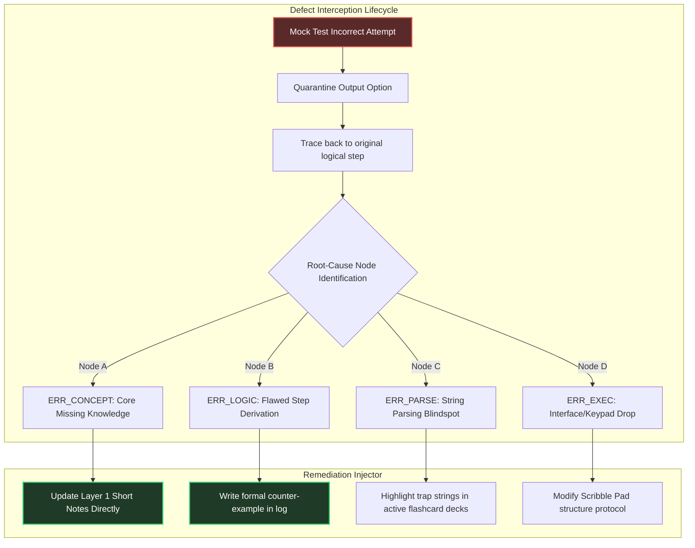
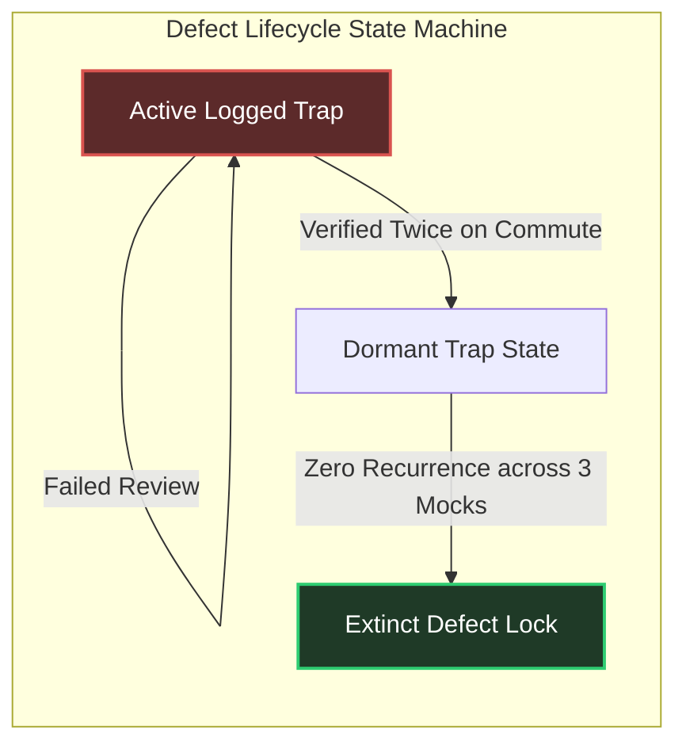

# Error Log System Architecture: Deterministic Root-Cause Trapping

To achieve an **All India Rank (AIR) under 100** across both data science and computer science streams over two cycles, dropping marks due to repeated failure modes is a fatal system vulnerability. Top candidates do not simply solve mock tests and compute cumulative scores; they construct an automated **Error Ledger** that intercepts, categorizes, and systematically annihilates logic breaks before they compound.

---

## 🔬 Anatomy of a Defect Trigger

An incorrect option selected during a mock test is merely a surface symptom. The **Error Log Engine** forces a highly structured analytical excavation to isolate the precise sub-layer where your cognitive compilation failed.



---

## 📋 The Master Defect Registry Template

Maintain this structured layout locally as a clean offline document or a searchable database table. Review it systematically during your **Evening Return Commutes**.

### Standardized Ledger Record Layout:

```markdown
### Record ID: `ERR-2026-08-14-DBMS-04`
- **Target Stream & Cycle:** GATE DA 2027 / Core Foundation
- **Subject / Module:** DBMS / Concurrency Control
- **Question Typology:** MSQ (Multiple Select Question)
- **Defect Class:** `ERR_CONCEPT` | Sub-Class: `Schedule Serializability`
- **Exact Trap Encountered:** Marked option stating *"Every view serializable schedule is also conflict serializable"* as True.
- **Root Cause Mechanics:** Assumed conflict equivalence is identical to view equivalence without checking for blind writes. Failed to parse the specific condition where un-conflict-serializable schedules can achieve serializability via view mapping.
- **Permanent Remediation:** Added an explicit counter-example matrix to **Layer 1 Short Notes**. Created an Active Recall flashcard explicitly pairing *"Blind Writes"* with *"View Serializability Expansion"*.
```

---

## 🔄 Automated Commute Traps Review Loop

Your **2-hour daily commute** provides an ideal friction-free zone for error elimination. Because reviewing past mistakes requires zero active desk writing, it aligns perfectly with the cognitive limitations of physical transit.

### The Commute Execution Sequence:
1. **Filter by State:** Open your offline Mistake Ledger PDF. Filter strictly for errors logged within the past 14 days.
2. **Mental Tracing:** Read the **Exact Trap Encountered** field. Pause. Trace the logical counter-example mentally without looking at the **Root Cause Mechanics**.
3. **Validation Check:** Reveal the underlying logic fix. If verified instantly, downgrade the error priority tag. If you hesitate, flag the record for immediate desktop verification during the upcoming weekend **Administrative Buffer Block**.

---

## 🔀 Evolution: Error Logging in Year 1 vs. Year 2

### Year 1 Profile (GATE 2027 Base Attempts)
- Focuses heavily on mapping initial conceptual misunderstandings (`ERR_CONCEPT`) and basic numeric interface usage (`ERR_EXEC`). The ledger acts as an instructional guide to avoid standard textbook misinterpretations.

### Year 2 Profile (GATE 2028 AIR <100 Peak Optimization)
- Shifts dramatically toward deep semantic parsing (`ERR_PARSE`) and complex multi-step edge cases (`ERR_LOGIC`). Since core concepts are fully established, errors logged in Year 2 consist almost entirely of extremely challenging MSQ boundary faults and advanced numerical integration traps.

---

## 📈 Pattern Elimination Velocity Tracking

To track your progress toward top-tier precision, monitor your **Defect Extinction Rate**.



### The 3-Strike Annihilation Rule
A logged mistake is not removed from your active review queue until it has been successfully avoided across **three independent mock tests** covering that overlapping sub-topic.

---

## 🛑 Critical System Traps

1. **The "Careless Mistake" Excuse:** Never write "careless mistake" in your log. If you compute $2+3=6$, trace it to its exact state: *Did you tap the multiplication key instead of addition on the virtual interface? Were your eyes fatigued? Was your scribble pad cluttered?* Force absolute specificity.
2. **Logging Every Direct Calculation Drop:** Avoid polluting your master concept ledger with pure numeric entry errors unless they reveal a consistent visual layout flaw. Keep numeric drops restricted to interface-execution protocols.
