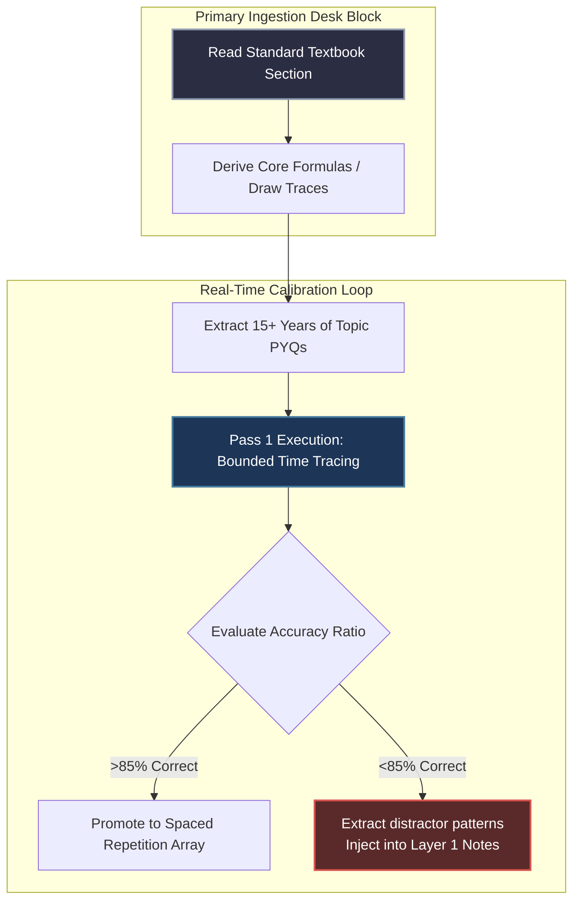

# Past Year Question (PYQ) Execution Architecture

To achieve an **All India Rank (AIR) under 100** across both data science and computer science streams over two cycles, you must abandon the standard candidate timeline of treating Past Year Questions (PYQs) as late-stage revision or end-of-subject tests. **PYQs are not testing material; they are your primary syllabus calibration tool.**

GATE panels rarely invent completely novel foundational logic from scratch; instead, they combine and mutate well-established historical exception traps. Integrating PYQs immediately post-chapter locks your mental analytical parser to exact official examiner constraints.

---

## 🧭 The Asynchronous Integration Lifecycle

You will execute PYQ parsing immediately upon finishing a textbook section, long before you feel fully "ready" or comfortable with the material.

---

## ⏱️ The 2-Pass PYQ Ingestion Algorithm

When attacking a fresh array of PYQs for a recently finished chapter module, execute the sweep using strict operational bounds.

### Pass 1: The Raw Simulated Execution (Timed)
- **Constraint:** Treat every individual question as an active exam scenario. Allocate exactly **2 minutes for 1-mark** and **3.5 minutes for 2-mark** questions.
- **Rule:** Absolute zero access to answer keys, hints, or formula sheets during the live solution trace. Box intermediate outputs directly on plain paper.

### Pass 2: The Reverse Semantic Sweep (Deep Analytical Post-Mortem)
- **Constraint:** Once Pass 1 concludes, do not simply check if your marked option matches the key. You must reverse-engineer the paper architect's psychology.
- **Execution Workflow:**
  1. For every incorrect or skipped question, trace the specific logical assertion that derailed your path.
  2. Examine the remaining 3 distractor options. Write down exactly what calculation error or conceptual blindspot would lead a candidate to mark each of those false states.
  3. Transfer the extracted trap logic directly into your **Error Log System** ([10_error_log_system.md](./10_error_log_system.md)).

---

## 🗺️ Exploiting the PYQ Overlap Engine Across Four Milestones

Because you are targeting both streams across 2027 and 2028, cross-pollinating PYQs grants an elite strategic advantage.

### Inter-Stream Exploitation Matrix

| Subject Domain | GATE DA 2027 Ingestion | GATE CSE 2027 Ingestion | GATE DA & CSE 2028 Optimization | Net Strategic Advantage |
| :--- | :--- | :--- | :--- | :--- |
| **Probability & Stats** | Solve DA sample sets + deep historical GATE Math stats sections. | Baseline cross-stream checks on standard distribution mechanics. | Advanced proofs, multivariate statistics, and continuous expectation sweeps. | Eliminates standard CS vulnerability to continuous distribution variations. |
| **Data Structures** | Solve historical CSE basic tree/array/stack questions up to 2015. | Benchmark execution speed on tree traversals and array indexing. | Master modern multi-paradigm questions (2016-Present) + highly complex recursive stack traces. | Builds bulletproof structural manipulation capability before tackling advanced algorithms. |
| **Database Management** | Parse pure SQL and relational algebra questions across both streams. | Basic checks on ER schemas and query formulation efficiency. | Attack serializability schedules, deep B+ tree node splits, and concurrency locking protocols. | Maximizes core database scoring with zero redundant overlap preparation. |

---

## 🔀 Evolution: PYQ Execution in Year 1 vs. Year 2

### Year 1 PYQ Profile (GATE 2027 Foundations)
- Focuses on categorizing question formats, understanding standard numerical setups, and building immediate chapter-level confidence. Every question is solved line-by-line to internalize standard solution templates.

### Year 2 PYQ Profile (GATE 2028 AIR <100 Optimization)
- Bypasses straightforward, repetitive calculations entirely. Focuses exclusively on **high-frequency trap variants**, complex multi-statement MSQ assertions, and high-speed mental pathfinding to verify options in under 60 seconds.

---

## 🛑 Critical System Traps

1. **The Memorization Fallacy:** Reading a question, remembering the final answer string from a previous viewing, and marking it true without drawing the complete step-by-step trace gives zero preparation value. **You must verify the trace path every single time.**
2. **Selective Filtering:** Skipping older PYQs (pre-2005) under the assumption that the pattern is outdated. While the layout formats shift over time, the mathematical core of older IIT papers is exceptionally pure and frequently resurfaces as multi-select MSQ assertions in modern sets. Parse them exhaustively.
