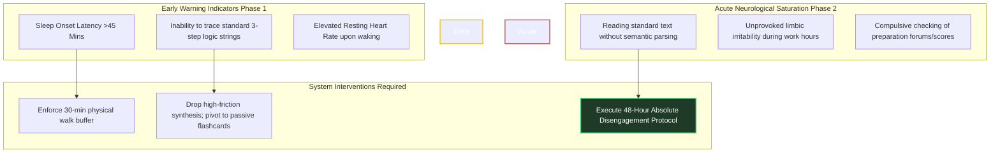

# Burnout Prevention & Neurological Recovery Systems

Executing an intensive study roadmap across two full years targeting four distinct GATE examination milestones while maintaining high-quality professional weekday output is an extreme cognitive stressor. Chronic activation of your sympathetic nervous system without structured, non-negotiable biological recovery leads directly to **Adrenal Fatigue, Central Nervous System Saturation, and Executive Functioning Collapse**.

This operating system treats recovery not as optional leisure or self-indulgence, but as a mandatory biological maintenance sub-routine engineered specifically to protect structural long-term learning capability.

---

## 🛑 Neurological Overtraining Symptoms

Do not rely on subjective, surface-level feelings of fatigue. Actively monitor these explicit biological and behavioral warning signs to detect systemic burnout before it triggers cascading schedule failures and multi-week study abandonment.

---

## 🛡️ The 48-Hour Absolute Disengagement Protocol

If you trigger **Acute Neurological Saturation**, trying to push through using brute-force willpower guarantees zero semantic assimilation and introduces dangerous conceptual errors into your note extraction layers. You must execute an immediate operational freeze.

### Protocol Parameters:
1. **Zero Device Access:** Disconnect all preparation devices, digital flashcards, and online testing dashboards for exactly 48 hours.
2. **Context Stripping:** Remove standard textbooks and loose-leaf notes from your immediate visual fields. Move them into closed cabinets or decoupled physical spaces.
3. **Passive Aerobic Reset:** Engage in unstructured outdoor walking or gentle cycling without audio input. Rhythmic physical movement flushes residual cortisol and lactate out of your muscular and neural networks.
4. **Sleep Saturation:** Extend sleep allocation to an **un-alarmed 9-hour recovery window**. Let the central nervous system run un-interrupted glymphatic cleanup cycles.

---

## 🔋 Micro-Recovery Mechanics (Daily Buffer Insertion)

To sustain elite abstraction capacity day after day, inject these small, non-negotiable biological down-regulators directly into your execution flow.

### The 20-20-20 Visual Rest Loop
During prolonged Desk Deep Work Blocks:
- **Trigger:** Every 20 minutes of continuous textbook/pad focus.
- **Action:** Gaze at an object exactly **20 feet away** for exactly **20 seconds**.
- **Biological Result:** Relaxes ciliary muscular contraction and flushes short-term visual processing buffers.

### The Dopamine Baseline Protection Rule
Do not pair high-dopamine activities (e.g., hyper-palatable snack ingestion, fast-paced mobile gaming, continuous social media scrolling) with your recovery breaks. A sudden spike in exogenous dopamine down-regulates your baseline tonic state, making the low-dopamine friction of deep textbook reading feel exponentially more painful upon return. **Keep breaks completely neutral and unstimulated.**

---

## 🔀 Adaptations: Preserving Stamina in Year 1 vs. Year 2

### Year 1 Stamina Preservation (GATE 2027 Foundations)
- Emphasizes building consistent routines without early overexertion. Early burnout in Year 1 destroys the foundation needed for the complex CS abstractions of Year 2. Protect sleep boundaries fiercely during initial mathematical base building.

### Year 2 Stamina Preservation (GATE 2028 AIR <100 Peak Optimization)
- Year 2 introduces high-frequency mock testing sweeps. Simulation fatigue compounds rapidly. Incorporate proactive physical walk buffers on Sunday afternoons immediately following full-length Post-Mortems to prevent mental saturation before starting the fresh professional work week.

---

## 📋 The Recovery Scheduling Matrix

| Stress Vector | Frequency | Permissible Recovery Action | Strictly Prohibited Response |
| :--- | :--- | :--- | :--- |
| **Daily Desk Exhaustion** | Post 1-Hour Block | Box breathing; visual horizon gaze; absolute silence. | Opening professional emails immediately; scanning messaging applications. |
| **Weekly Fatigue Accumulation**| Saturday 10:30 Break | Outdoor walk; hydration sweep; passive stretching. | Watching technical overview videos under the guise of "light study." |
| **Monthly Saturation** | Last Weekend Block | Executing structured **Buffer Recovery Flow**; complete leisure block. | Forcing extra Full-Length Tests out of anxiety or peer comparison. |

---

## 🛑 Critical System Traps

1. **The Martyrdom Illusion:** Glorifying sleep deprivation and endless study grinds guarantees severe exam-day brain fog. Elite execution requires absolute physical and mental peak performance. **Protect your 7-hour baseline recovery sleep aggressively.**
2. **The "Just One More Page" Trap:** If your scheduled deep work desk block ends at 07:45, **terminate writing at exactly 07:45.** Overrunning temporal boundaries depletes the psychological reserves required to launch the engine smoothly tomorrow morning. Always leave the tank slightly full.
