# Systems-Driven Consistency over Fragile Motivation

Relying on transient emotional motivation to execute a rigorous **two-year preparation architecture** spanning four examination targets alongside demanding corporate engineering deliverables is a mathematically guaranteed path to schedule failure. Motivation is a highly volatile biological state dictated by sleep quality, external validation, team stress, and ambient fatigue.

This operating system strips subjective motivation out of the execution loop entirely. We replace it with an unyielding **Momentum Architecture** engineered to produce consistent behavioral execution regardless of your internal emotional weather.

---

## ⚙️ The Behavioral Execution Engine

Action does not follow emotional state; **emotional state follows structured action.** By systematically minimizing activation friction, we force immediate mechanical engagement that automatically triggers sustained focus loops.

```mermaid
graph TD
    subgraph Motivation Model Brute-Force Willpower
        Feel[Wait for Positive Emotional State] -->|Highly Variable| Act[Execute Deep Study Block]
        Act --> Outcome[Volatile Retention & Inconsistent Tracking]
    end

    subgraph Systems Engine Mechanical Ignition
        Trigger[External System Trigger<br>Pre-Staged Desk / Time Anchor] --> Friction[Minimal Action Interface<br>Solve exactly 2 PYQs]
        Friction --> Loop[Dopaminergic Competence Feedback Loop]
        Loop --> Flow[Automated 60-Minute Synthesis Lock]
    end

    style Feel fill:#5a2a2a,stroke:#d9534f,stroke-width:2px,color:#fff
    style Trigger fill:#1f3a27,stroke:#2ecc71,stroke-width:2px,color:#fff
    style Flow fill:#1d3557,stroke:#457b9d,stroke-width:2px,color:#fff
```

---

## 🧱 The Environment Pre-Staging Imperative

If you have to search for your pen, locate the correct loose-leaf notebook section, and find your downloaded offline PDF at 06:30 AM, your brain will reject the session. **Environment design dictates execution velocity.**

### The Sunday Evening Setup Checklist
Every Sunday during your Administrative Buffer Block, execute these precise structural preparation stages:
1. **Physical Isolation:** Clear your deep-work desk of all corporate documentation, work laptops, and extraneous clutter. Leave exactly **one textbook**, **one open loose-leaf binder**, and **one working pen** positioned precisely where your hands will rest.
2. **Visual Cue Anchoring:** Place your **Master Target Module Sheet** directly on the wall or standing display in front of your desk chair.
3. **Digital Elimination:** Leave your smartphone charging in a completely decoupled physical room overnight. Use a dedicated physical alarm clock to wake up. Completely eliminate the Morning Screen-Check habit.

---

## 📈 The Measurable Milestone Array Across Two Years

To sustain extreme engagement across multiple quarters and exam cycles, break long-range outcomes into tight, verifiable **Key Performance Indicators (KPIs)**. Celebrate the mechanical execution of structured inputs, not fluctuating early mock test outputs.

### Weekly Input KPIs:
- **Consistency Score:** $\frac{\text{Completed Weekday Desk Blocks}}{\text{5 Available Weekdays}} \times 100$. *(Target Baseline: >80%)*.
- **Transit Exploitation:** Total minutes of active offline flashcard/PDF reading logged during commute transit. *(Target Baseline: >450 Minutes weekly)*.
- **PYQ Volume:** Total raw questions parsed, reverse-engineered, and cataloged into your offline master tracking log.

---

## 🔄 The 5-Minute "Lower the Bar" Rule

When acute physical or mental fatigue makes a scheduled 1-hour desk block feel insurmountable, deploy the **Micro-Ignition Protocol**:
- **Assertion:** Tell yourself aloud, *"I am only going to open the hardcover and trace exactly one single block diagram or solve one straightforward 1-mark PYQ. Then I am fully permitted to close the book and exit."*
- **Neurological Outcome:** Once initial limbic starting resistance is breached and physical writing begins, the prefrontal cortex automatically loads the technical context into working memory. Over 85% of the time, operational momentum carries you straight through the full scheduled duration. If you genuinely desire to stop after 5 minutes, accept the micro-win and exit guilt-free.

---

## 🛑 Critical System Traps

1. **Watching Motivational Content:** Consuming generic preparation strategy videos or exam success interviews releases dopamine without requiring cognitive effort. Your brain experiences the psychological reward of preparation without extracting a single byte of technical syllabus. **Strip motivational consumption completely.**
2. **The "All-or-Nothing" Fallacy:** If you wake up 20 minutes late and possess only 40 minutes available for your morning desk block, do not cancel the session. Execute a concentrated 40-minute extraction sweep. **Partial structural execution always out-competes complete inaction.**
