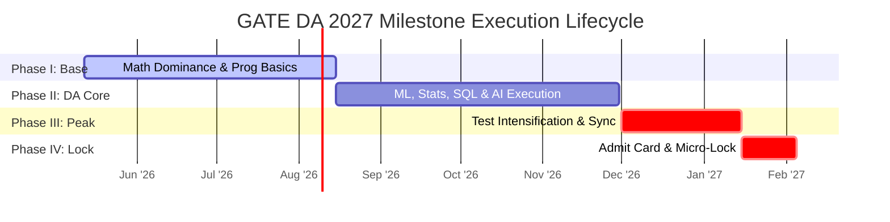

# Master Execution Roadmap: GATE DA 2027 (May 2026 - Feb 2027)

## ⏳ Current Execution Origin: 12 May 2026

You have exactly **~9 months** remaining until the highly probable examination window for **GATE Data Science & Artificial Intelligence (DA) 2027** (expected early February 2027). 

Within this integrated preparation operating system, **GATE DA 2027 represents your primary serious competitive attempt for Year 1.** The goal is establishing an elite baseline, securing an unshakeable national rank, building high-fidelity layered notes, and executing robust simulation routines. This roadmap deploys an **Adaptive Bounded Timeline** tailored for a candidate with full-time corporate engineering commitments.

---

## 🏛️ Macro Execution Phases

---

## 🗓️ Granular Progression Strategy

### Phase I: Mathematical Dominance & Programming Ignition (12 May 2026 - 15 August 2026)
*Target: Securing early unshakeable competence by exploiting ECE mathematical foundations.*

- **Technical Execution Goals:**
  - Complete deep parsing of **Linear Algebra** and **Probability Basics** via primary reference texts.
  - Complete **Python Foundations** (data types, logic structures, iteration loops, core libraries).
  - Complete initial parsing of **Core Data Structures** (Arrays, Stacks, Queues, simple Binary Trees).
- **Administrative Milestones:**
  - Setup physical desk boundaries and configure offline sync environments for daily travel transit.
- **Measurable End-of-Phase KPI:** Secure **>90% raw scoring** across all multi-year Linear Algebra and simple Probability PYQs.

---

### Phase II: The DA Scoring Engine Divergence (16 August 2026 - 30 November 2026)
*Target: Ingestion of pure Data Science theory, statistical inference, and relational design.*

- **Technical Execution Goals:**
  - Deep-dive into **Advanced DA Statistics** (Continuous distributions, conditional expectations, t/z/chi-square hypothesis tests).
  - Complete **Machine Learning Core** (Supervised algorithms, Regression, Classification, Clustering, K-Means, SVM foundations).
  - Complete **Relational DBMS & SQL** (ER mapping, relational algebra, query formulation, basic indexing logic).
  - Complete **Artificial Intelligence Basics** (State spaces, search heuristics, A* algorithms).
- **Administrative Milestones:**
  - **GATE 2027 Official Registration Window Open (Probable: Late Aug/Sept 2026).** Ensure double precision entry of application documents, primary stream options, and graduation details.
- **Measurable End-of-Phase KPI:** Successful compilation of **Layer 1 Short Notes** across the entire DA core syllabus.

---

### Phase III: Test Series Intensification & Synthesis Consolidation (1 December 2026 - 15 January 2027)
*Target: Bridging standalone chapter theory to integrated 180-minute paper endurance.*

- **Technical Execution Goals:**
  - Shift weekday morning desk blocks exclusively to solving **Sectional Topic Tests**.
  - Execute exactly **One Full-Length Mock Test every Sunday** under absolute simulated exam isolation constraints.
  - Dedicate full Saturdays to **Exhaustive Question-by-Question Post-Mortems** and updating the **Error Log System**.
- **Adaptive Contingency Window:** Protect the final two weeks of December entirely from fresh primary reading to absorb potential corporate project overruns or winter team leaves.
- **Measurable End-of-Phase KPI:** Achieve consistent scores exceeding **75/100** across verified full-length test panels.

---

### Phase IV: Admit Card Lockdown & Micro-Map Traversal (16 January 2027 - Exam Day Feb 2027)
*Target: Absolute neurological calibration and short-note memory consolidation.*

- **Technical Execution Goals:**
  - Terminate all full-length mock testing exactly **7 days prior** to the probable exam date to prevent late-stage confidence shocks.
  - Weaponize commute transit strictly for scanning **Ultra-Short Revision Sheets** and Formula inverse flashcard arrays.
- **Administrative Milestones:**
  - **GATE 2027 Admit Card Retrieval (Probable: Early Jan 2027).** Verify exam center geography, transport logistics, virtual interface parameters, and scribble pad rules.
- **Measurable End-of-Phase KPI:** **Defect Extinction Rate** reaching 100% across critical logged errors in your offline database.

---

## 🛡️ Fallback & Adjustment Protocols

Because official exam schedules are not yet announced, this timeline maintains intrinsic structural elasticity.
- **Scenario A (Exam Scheduled Early - First Week of Feb):** Compress the final Phase III test queue by merging Wednesday sectional sweeps. Strip peripheral AI reasoning chapters to guarantee absolute retention of core ML derivations.
- **Scenario B (Registration/Exam Delayed):** Do not pause syllabus maintenance loops. Use the added buffering space to run additional Python array manipulation implementations locally on your desktop.
