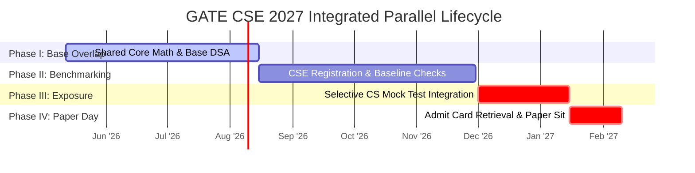

# Master Execution Roadmap: GATE CSE 2027 (May 2026 - Feb 2027)

## ⏳ Current Execution Origin: 12 May 2026

You have exactly **~9 months** remaining until the probable examination window for **GATE Computer Science & Information Technology (CSE) 2027** (expected early February 2027). 

Crucially, within this integrated operating system, **GATE CSE 2027 is treated as a foundational alignment and cross-stream benchmarking attempt.** Your primary competitive focus for 2027 remains GATE DA. Therefore, this roadmap establishes a **non-disruptive parallel alignment strategy** to sit for the CSE paper confidently, test real-paper problem-solving friction, and map exact technical boundaries for the Year 2 bridge without diluting your DA scoring capability.

---

## 🏛️ Macro Execution Framework: Parallel Base Alignment

---

## 🗓️ Granular Progression Strategy

### Phase I: Overlap Extraction & Shared Foundations (12 May 2026 - 15 August 2026)
*Target: Extracting full CSE foundational value from required DA preparation modules.*

- **Technical Execution Goals:**
  - Build strong baseline **C++ syntax comprehension** parallel to required Python coding mechanics.
  - Master foundational **Arrays, Stacks, Queues, and simple Binary Trees** which are fully shared across both syllabi.
  - Complete all **Engineering Mathematics** components (Linear Algebra, Calculus, Probability) to secure the shared 28-30 mark baseline across both papers.
- **Administrative Milestones:**
  - Establish offline storage workflows ensuring standard reference text PDFs for shared subjects are available.
- **Measurable End-of-Phase KPI:** Achieve flawless compilation of core tree traversals and recursive back-tracking logic on paper.

---

### Phase II: Registration Benchmarking & Overlap Lock (16 August 2026 - 30 November 2026)
*Target: Locking down overlapping DA modules that directly yield CSE marks.*

- **Technical Execution Goals:**
  - Leverage DA Relational DBMS reading to master **SQL query formulation, relational algebra expressions, and base ER schemas** for the CSE syllabus.
  - Utilize DA basic AI state space algorithms to reinforce understanding of **Graph traversal arrays (BFS/DFS)**.
- **Administrative Milestones:**
  - **GATE 2027 Registration Window Open (Probable: Late Aug/Sept 2026).** Ensure registration for **BOTH** DA and CS streams as two paper combinations. Validate exact eligibility configurations for ECE B.Tech graduates appearing in secondary papers.
- **Measurable End-of-Phase KPI:** Secure **>80% accuracy** on shared SQL and basic structural array PYQs from historical CSE papers.

---

### Phase III: Selective CS Mock Integration (1 December 2026 - 15 January 2027)
*Target: Testing CSE 180-minute paper endurance without primary reading disruption.*

- **Technical Execution Goals:**
  - Do NOT start reading fresh primary texts for OS, CN, TOC, or Compiler Design. **Leave those subjects conceptually empty for 2027.**
  - Execute exactly **two standalone Full-Length simulated CSE papers** in early January to benchmark unstudied performance.
  - Train analytical problem-solving reflexes by attempting unread questions via logical elimination and basic digital logic design knowledge from your ECE degree.
- **Measurable End-of-Phase KPI:** Establish an unstudied baseline attempt score exceeding **45-55/100** strictly via Math, Aptitude, Base DSA, SQL, and Digital Logic.

---

### Phase IV: Real-Paper Traversal & Gap Mapping (16 January 2027 - Exam Day Feb 2027)
*Target: Absolute interface navigation and real-time environment absorption.*

- **Technical Execution Goals:**
  - Review only General Aptitude flashcards and shared Math formula inverse sheets during travel transit.
  - Sit for the official GATE CSE 180-minute paper with zero pressure. Focus entirely on analyzing paper layout, virtual interface latency, and the physical stamina demands of multiple sessions.
- **Administrative Milestones:**
  - **GATE 2027 Admit Card Retrieval (Probable: Early Jan 2027).** Coordinate multi-day travel logistics if DA and CSE paper sessions are scheduled on alternate days or distinct exam slots.
- **Measurable Terminal Outcome:** Complete logging of real-paper architectural friction to stage the Year 2 master progression instantly post-exam.

---

## 🛡️ Fallback & Adjustment Protocols

- **Scenario A (Syllabus Clashes):** If DA revision demands extra desk blocks in December, drop the standalone CSE mock tests entirely. The CSE attempt must never extract time buffers from the primary DA competitive peak.
- **Scenario B (Schedule Compression):** If official exam schedules place DA and CSE on consecutive days, prioritize sleep and nutritional recovery immediately following the first exam. Avoid late-night formula reviews between the two papers.
