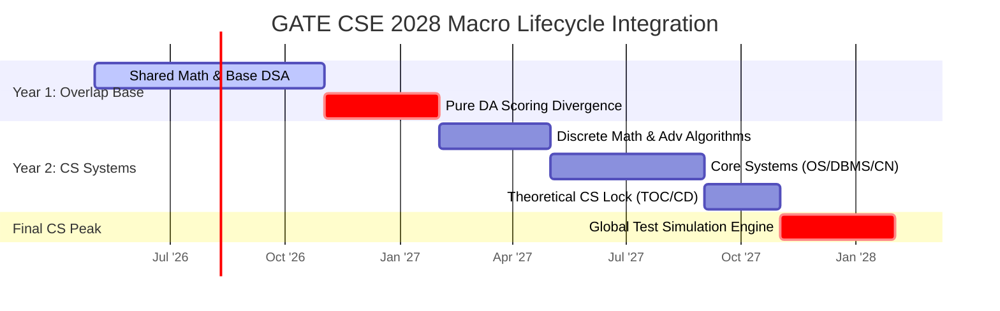

# Master Execution Roadmap: GATE CSE 2028 (May 2026 - Feb 2028)

## ⏳ Long-Range Strategic Perspective

While your immediate goal targets GATE DA in February 2027, your terminal objective is securing an **AIR under 100 in GATE CSE 2028**. 

This requires an exhaustive **21-Month Bridge Architecture** that leverages your overlapping preparation during Year 1 to systematically master the deep theoretical abstractions of Core Computer Science in Year 2.

---

## 🏛️ Macro Execution Framework: The 21-Month Bridge

---

## 🗓️ Granular Progression Strategy

### Phase I: Dual Stream Base Alignment (May 2026 - Nov 2026)
*Target: Extracting CSE foundational value from required DA preparation modules.*
- **Strategic Actions:**
  - Build strong C++ understanding parallel to required Python coding mechanics.
  - Master foundational tree arrays and searching algorithms native to both exam syllabi.
  - Complete all engineering mathematics probability and vector metrics to eliminate baseline CS vulnerabilities.

---

### Phase II: The Tactical DA Interruption (Dec 2026 - Feb 2027)
*Target: Complete freeze of pure CS theory to secure elite Year 1 outcomes.*
- **Strategic Actions:**
  - Park all pending OS process schedules, TCP networks, and Automata theories.
  - Execute live DA test environments exclusively.
- **Post-Exam Pivot:** Take exactly **7 days of complete physical rest** following the February 2027 DA exam before launching the Year 2 CSE Engine.

---

### Phase III: The Core CS Systems Onboarding (March 2027 - August 2027)
*Target: Demystifying core computing mechanics for an ECE graduate.*

- **Technical Execution Sequencing:**
  1. **Discrete Mathematics:** Formal logic, set properties, group theory, and graph topologies.
  2. **Advanced Algorithms:** Asymptotic limits, dynamic programming matrices, greedy optimization states, and complex graph traversals.
  3. **Operating Systems:** Concurrency mechanisms, semaphores, virtual memory layouts, and secondary device scheduling.
  4. **Advanced Database Management:** Extending DA SQL knowledge into internal physical file organizations, B+ tree indexing, and serializability schedules.
  5. **Computer Networks:** Parsing the standard protocol stacks, sliding window flow logic, and IP dynamic routing setups.

---

### Phase IV: Theoretical CS Capstone & Optimization (September 2027 - November 2027)
*Target: Highly deterministic logic locks.*

- **Technical Execution Sequencing:**
  1. **Theory of Computation (TOC):** Deterministic machines, context-free parsing rules, and recursive enumerability boundaries.
  2. **Compiler Design (CD):** Lexical parsing automata, LL/LR parsing tables, and intermediate code string translations.
  3. **Targeted COA:** Strictly bounded reading of direct cache mapping formulas and execution instruction pipeline mechanics.

---

### Phase V: Final Compounding Simulation Engine (December 2027 - Exam Day Feb 2028)
*Target: Absolute execution automation across full-length simulated panels.*
- **Technical Execution Goals:**
  - Execute exactly **two full-length tests weekly** alongside complete analytical reviews.
  - Deploy **Ultra-Short Revision Sheets** across both Track A (Theory) and Track B (Systems) during daily commuting arrays.
- **Administrative Milestones:**
  - **GATE 2028 Registration Window (Probable: Sept 2027).**
  - **GATE 2028 Admit Card Retrieval (Probable: Jan 2028).**
- **Measurable Terminal KPI:** Secure mock test baseline attempts exceeding **85/100** with net negative bleeds approaching absolute zero.
