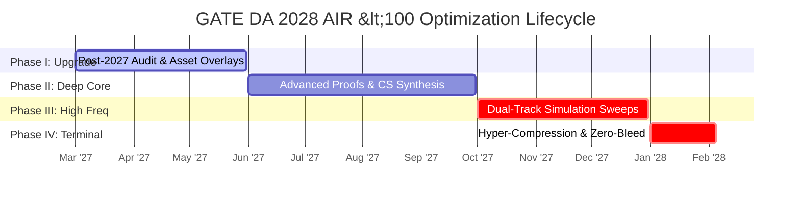

# Master Execution Roadmap: GATE DA 2028 (March 2027 - Feb 2028)

## ⏳ Strategic Baseline: March 2027 Transition

Following your initial competitive attempt in GATE DA 2027, the primary objective transitions from foundational syllabus coverage to **uncompromising technical depth, edge-case mastery, and simulated execution speed.** 

Within this integrated preparation operating system, **GATE DA 2028 represents your targeted peak-performance attempt to secure an All India Rank (AIR) under 100.** Because the core primary definitions, baseline mathematics, and Python syntactical rules were fully consolidated during Year 1, Year 2 strips away slow reading cycles. The roadmap weaponizes your established loose-leaf assets to execute advanced mathematical proofs, complex Inter-Stream PYQ extraction sweeps, and high-frequency defect elimination loops.

---

## 🏛️ Macro Execution Framework: Peak Refinement Lifecycle

---

## 🗓️ Granular Progression Strategy

### Phase I: Asset Upgradation & Post-Mortem Deep Audit (1 March 2027 - 31 May 2027)
*Target: Auditing Year 1 gaps and embedding high-level overlays onto established notes.*

- **Technical Execution Goals:**
  - Execute a comprehensive **Question-by-Question audit** of your official GATE DA 2027 paper alongside your **Layer 1 Short Notes**.
  - Insert loose-leaf spacer pages into your binders to document advanced continuous probability distributions, complex matrix transformations, and multi-variable optimization calculus.
  - Review and reconstruct all incorrect mock test attempts from the previous cycle using your **Error Log System** ([10_error_log_system.md](./10_error_log_system.md)).
- **Administrative Milestones:**
  - Recalibrate your spaced repetition flashcard configurations, archiving basic terminology cards to prioritize complex mathematical boundary equations.
- **Measurable End-of-Phase KPI:** Zero retention degradation of Year 1 foundational material; 100% completion of the 2027 Post-Mortem gap ledger.

---

### Phase II: Mathematical Proofs & CS Inter-Stream Synthesis (1 June 2027 - 30 September 2027)
*Target: Eliminating conceptual vulnerabilities across advanced Machine Learning and AI models.*

- **Technical Execution Goals:**
  - Master the mathematical derivations behind **Kernelized SVMs, Deep Neural Network backpropagation matrices, and advanced clustering optimization targets**.
  - Deepen database indexing knowledge by parsing advanced B+ tree node splitting mechanics and conflict serializability schedules extracted from historical CSE archives.
  - Execute advanced algorithmic tracing on paper, testing non-standard tree heuristics and adversarial game search strategies (Minimax with alpha-beta pruning).
- **Administrative Milestones:**
  - **GATE 2028 Official Registration Window Open (Probable: Late Aug/Sept 2027).** Register for the DA/CS dual-paper combination with peak operational focus.
- **Measurable End-of-Phase KPI:** Consistent verification of mathematical proof steps from memory without checking reference source texts.

---

### Phase III: High-Frequency Dual-Track Simulation Sweeps (1 October 2027 - 31 December 2027)
*Target: Forcing operational endurance through overlapping high-intensity testing loops.*

- **Technical Execution Goals:**
  - Transition weekday morning desk blocks into **High-Speed PYQ / MSQ Parsing Sweeps**, validating 2-mark options in under 60 seconds.
  - Execute **Two Full-Length Mock Tests weekly** (alternating DA and CS environments) to build elite biological context-switching resistance.
  - Enforce exhaustive multi-hour Post-Mortem analytics on Sundays, targeting absolute zero unforced calculation and interface entry errors.
- **Measurable End-of-Phase KPI:** Maintain an **Attempted Marks Ratio exceeding 92%** with test accuracy consistently pegged above **90%** across elite test panels.

---

### Phase IV: Terminal Hyper-Compression & Zero-Bleed Lock (1 January 2028 - Exam Day Feb 2028)
*Target: Total defect extinction and perfect digital keypad precision.*

- **Technical Execution Goals:**
  - Strip margin notes down to pure **Layer 2 Ultra-Short Sheets** and **Layer 3 Formula Arrays**.
  - Limit transit active recall strictly to parsing boundary conditions where standard machine learning estimators break down.
  - Terminate simulated testing 7 days prior to exam rollout.
- **Administrative Milestones:**
  - **GATE 2028 Admit Card Retrieval (Probable: Early Jan 2028).** Pre-stage travel geography and physical test-day variables.
- **Measurable Terminal Outcome:** Securing a target raw score boundary of **>78-82/100** on simulated papers, guaranteeing competitiveness for an **AIR <100**.

---

## 🛡️ Fallback & Adjustment Protocols

- **Scenario A (Testing Saturation):** If attempting dual full-length mock tests weekly induces measurable nervous system fatigue or drops short-term accuracy, drop the Wednesday mock immediately. Preserve the Sunday simulation as an absolute non-negotiable anchor.
- **Scenario B (Workplace Interruption):** If end-of-year corporate deliveries limit December desk blocks, execute backlog compression flows directly during the commute, offloading primary review cycles to dedicated weekend reserves.
