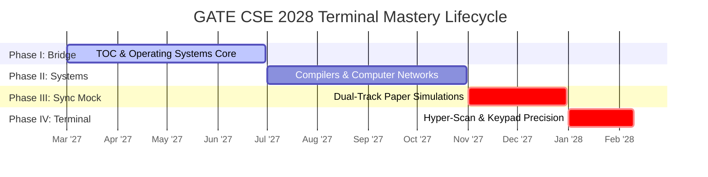

# Master Execution Roadmap: GATE CSE 2028 (March 2027 - Feb 2028)

## ⏳ Strategic Baseline: The Year 2 Core Bridge

Following your parallel exposure attempt in GATE CSE 2027, the operational focus undergoes a profound structural shift. While Year 1 leveraged shared mathematical and basic structural concepts to sit for the CSE paper without distraction, **Year 2 activates the comprehensive Computer Science Systems Core.** 

Within this integrated preparation operating system, **GATE CSE 2028 represents your terminal mastery attempt engineered to secure an All India Rank (AIR) under 100.** Because your transition from ECE is anchored by solid mathematical maturity and deep programming logic consolidated during Year 1, you are uniquely positioned to ingest abstract computer science systems (Operating Systems, Computer Networks, Theory of Computation, and Compilers) at an accelerated velocity.

---

## 🏛️ Macro Execution Framework: The CS Systems Core Bridge

---

## 🗓️ Granular Progression Strategy

### Phase I: The Theoretical & Systems Core Bridge (1 March 2027 - 30 June 2027)
*Target: Ingesting fundamental CS state logic and process management abstractions.*

- **Technical Execution Goals:**
  - Complete deep primary reading of **Theory of Computation (TOC)**: master DFAs/NFAs, regular expressions, Context-Free Grammars, Pushdown Automata, and Turing machine decidability boundaries.
  - Complete deep primary reading of **Operating Systems (OS)**: process synchronization, semaphores, mutexes, deadlock prevention matrices, paging, and virtual memory page replacement algorithms.
  - Re-verify overlapping **Data Structures & Algorithms** advanced arrays to maintain active problem-solving reflexes.
- **Measurable End-of-Phase KPI:** Successful compilation of complete **Layer 1 Short Notes** for TOC and OS; **>85% accuracy** on all multi-year sectional PYQs for both subjects.

---

### Phase II: Deep Systems Synthesis & Protocol Parsing (1 July 2027 - 31 October 2027)
*Target: Conquering low-level syntax translations and complex network topologies.*

- **Technical Execution Goals:**
  - Complete primary reading of **Compiler Design**: lexical token streams, top-down/bottom-up parsers (LL/LR/SLR/LALR), syntax-directed translations, and intermediate code generation.
  - Complete primary reading of **Computer Networks (CN)**: deep protocol analysis across Application, Transport (TCP windowing/congestion control), Network (IP subnetting, Dijkstra/Bellman-Ford routing), and Link layers.
  - Execute integrated **Database Systems** reviews, focusing heavily on transaction serializability and indexing overlaps.
- **Administrative Milestones:**
  - **GATE 2028 Official Registration Window Open (Probable: Late Aug/Sept 2027).** Ensure flawless submission for the CS/DA combination.
- **Measurable End-of-Phase KPI:** Consistent parsing of LL(1) and LR(0) item sets on paper without compilation errors.

---

### Phase III: Synchronized Dual-Track Paper Simulations (1 November 2027 - 31 December 2027)
*Target: Forcing absolute technical execution speed across diverse simulated environments.*

- **Technical Execution Goals:**
  - Shift weekday morning desk blocks into intense **Multi-Subject Sectional Test Sweeps**, practicing instant context switching between CN subnetting calculations and Compiler syntax trees.
  - Execute **Two Full-Length Mock Tests weekly** (interleaving CSE and DA test series) under strict 180-minute biological sitting isolation.
  - Weaponize full weekends for exhaustive Post-Mortem Post-Test tracing, feeding structural logic traps directly into your **Error Log System** ([10_error_log_system.md](./10_error_log_system.md)).
- **Measurable End-of-Phase KPI:** Achieve consistent raw mock test scores exceeding **75-80/100** on simulated full-length CSE panels.

---

### Phase IV: Terminal Hyper-Scan & Keypad Precision Lock (1 January 2028 - Exam Day Feb 2028)
*Target: Absolute defect extinction and zero-bleed calculation boundaries.*

- **Technical Execution Goals:**
  - Strip margin and summary notes down to hyper-focused **Layer 2 Ultra-Short Sheets** custom-rendered for rapid commute transit review.
  - Conduct systematic double-checks on virtual interface input operations, ensuring absolute unit alignment on numerical answer keypad fields.
  - Terminate simulated testing exactly 7 days before exam day.
- **Administrative Milestones:**
  - **GATE 2028 Admit Card Retrieval (Probable: Early Jan 2028).** Confirm exact testing schedules, session slots, and physical desk environments.
- **Measurable Terminal Outcome:** Complete readiness to achieve an **AIR <100** by securing flawless execution on the final paper.

---

## 🛡️ Fallback & Adjustment Protocols

- **Scenario A (Systems Ingestion Lag):** If complex protocols in Computer Networks require extra desk reading buffers during October, strip secondary compiler optimization sub-topics to safeguard core routing and subnetting calculations.
- **Scenario B (Testing Overlap Overrun):** If executing dual mock testing alongside corporate commitments causes severe sleep deficit, alternate the full-length test weeks while executing rapid Post-Mortem analyses asynchronously during transit.
