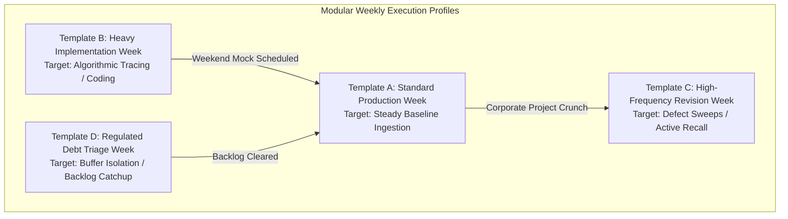

# Modular Weekly Study Templates

To manage an intensive **two-year preparation timeline** covering four target examination milestones without accumulating operational burnout or scheduling failure, your weekly execution cannot remain static. Depending on corporate workload intensity, physical energy levels, and exam proximity, deploy one of these four standardized modular templates.

---

## 🧭 Weekly Macro Architecture Overview

---

## 📋 Template A: Standard Production Week
*Optimal state: Steady workday shift; balanced biological energy baseline.*

- **Monday - Friday Desk Blocks (5 Hours Total):** Primary reference text chapter ingestion + real-time short-note extraction sweeps.
- **Monday - Friday Commute Blocks (10 Hours Total):** Active digital flashcard verification + offline formula parsing.
- **Saturday Execution (8 Hours):** Deep morning theoretical synthesis + immediate chapter PYQ extractions.
- **Sunday Execution (8 Hours):** Integrated 90-minute Sectional Test + complete analytical Post-Mortem Post-Test reviews.

---

## 📋 Template B: Heavy Implementation Week
*Optimal state: Scheduled for Core DSA, Python/C++ logic loops, database indexing, or sliding window protocols.*

- **Weekday Desk Blocks:** Direct paper coding derivations. Trace out recursion trees and memory layouts manually before local execution.
- **Weekday Commute Blocks:** Scan visual trace arrays and relational data schemas via offline tablet storage.
- **Saturday Execution:** Complete local terminal execution of multi-step backtracking algorithms or advanced SQL queries.
- **Sunday Execution:** Topic testing + double-precision numerical answer evaluation sweeps.

---

## 📋 Template C: High-Frequency Revision Week
*Optimal state: Final phase consolidation windows leading up to target exam blocks.*

- **Weekday Desk Blocks:** Zero fresh chapter reading. Execute double-pass timed sectional tests exclusively.
- **Weekday Commute Blocks:** High-speed parsing of **Layer 2 Ultra-Short Revision Sheets** + inverse formula checks.
- **Weekend Execution:** Interleaved Full-Length Mock testing arrays alongside exhaustive root-cause mistake logging cycles.

---

## 📋 Template D: Regulated Debt Triage Week
*Optimal state: Following multi-day corporate travel overruns, severe delivery crunches, or physical recovery loops.*

- **Weekday Operations:** Strip active production modules completely. Transition commute times strictly to passive mental validation of existing consolidated notes.
- **Weekend Execution:** Deploy **Debt Compression Mechanics** ([08_backlog_recovery.md](./08_backlog_recovery.md)) to extract the minimum viable scoring core from quarantined backlog files.
