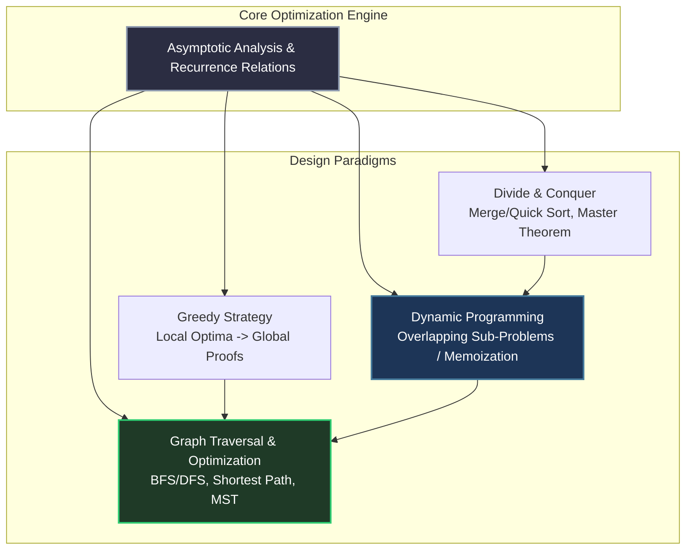

# Advanced Algorithms Mastery Architecture

To achieve an **AIR under 100 in GATE CSE 2028**, advanced algorithms must be comprehended structurally, not via brute-force code string memorization. Examiners test algorithms by modifying base recurrence equations or injecting custom edge weights into standard graph topologies, forcing real-time execution optimization.

---

## 🏛️ Macro Algorithmic Paradigm Integration

---

## 🔬 Core Paradigms & Deep Structural Mapping

### 1. Asymptotic Analysis & Recurrence Relations
- **Mastery Parameters:** Big-O ($\mathcal{O}$), Omega ($\Omega$), Theta ($\Theta$), little-o, little-omega bounds.
- **Solving Recurrences:** Substitution method, Recursion Tree method, Master Theorem (including all advanced boundary cases).
- **GATE Execution Trap:** Watch for logarithmic variable substitutions inside recursive loops (*e.g., $T(n) = T(\sqrt{n}) + 1$*). Let $n = 2^m$ to convert the root operation into linear iterations instantly.

### 2. Divide & Conquer
- **Core Mechanics:** Splitting global inputs into balanced independent partitions.
- **Algorithms Covered:** Binary Search variations, Merge Sort, Quick Sort (worst-case vs randomized pivots), Strassen’s Matrix Multiplication.
- **The Pitfall:** Ignoring memory overhead. Quick sort operates in-place ($\mathcal{O}(\log n)$ stack space); Merge sort requires auxiliary linear allocation space ($\mathcal{O}(n)$).

### 3. Dynamic Programming (DP)
- **Core Mechanics:** Tabulation vs Memoization. Resolving exponential redundant sub-problem calculations via state indexing caches.
- **Standard Gate Matrices:** Longest Common Subsequence (LCS), Matrix Chain Multiplication (MCM), 0/1 Knapsack, Bellman-Ford Shortest Path, Floyd-Warshall All-Pairs.
- **Execution Protocol:** Always map the **State Space Grid** on paper. Box the base matrix rows/columns. Trace the exact directional dependencies (*"Does cell $(i,j)$ depend on $(i-1, j)$ or $(i, j-1)$?"*).

### 4. Greedy Algorithms
- **Core Mechanics:** Making locally optimal parameter choices at every stage under the assumption of achieving global correctness.
- **Standard Gate Proofs:** Fractional Knapsack, Huffman Coding Trees, Job Sequencing with Deadlines.
- **The Pitfall:** Assuming a greedy path works without verifying the **Optimal Substructure** and **Greedy Choice Property**. Setters often create multi-select MSQs where standard greedy heuristics fail due to modified edge constraints.

### 5. Advanced Graph Algorithms
- **Traversals:** Breadth-First Search (BFS) for unweighted shortest paths; Depth-First Search (DFS) for structural cycle detection and topological sorting arrays.
- **Minimum Spanning Trees (MST):** Kruskal's (Union-Find component sorting) vs Prim's (Priority Queue node extraction).
- **Shortest Paths:** Dijkstra's algorithm (fails on negative weight edges) vs Bellman-Ford (detects negative cycle traps).

---

## 📋 Comparative Paradigm Complexity Matrix

| Algorithm Class | Average Time | Worst Case Time | Space Complexity | Primary Structural Vulnerability |
| :--- | :--- | :--- | :--- | :--- |
| **Quick Sort** | $\mathcal{O}(n \log n)$ | $\mathcal{O}(n^2)$ | $\mathcal{O}(\log n)$ stack | Already sorted inputs with static endpoints. |
| **Merge Sort** | $\mathcal{O}(n \log n)$ | $\mathcal{O}(n \log n)$ | $\mathcal{O}(n)$ aux memory | Highly constrained hardware memory boards. |
| **Dijkstra** | $\mathcal{O}(E \log V)$ | $\mathcal{O}(E \log V)$ | $\mathcal{O}(V)$ queue | Presence of negative weight directional edges. |
| **Floyd-Warshall**| $\mathcal{O}(V^3)$ | $\mathcal{O}(V^3)$ | $\mathcal{O}(V^2)$ matrix | Massive dense network vertex arrays. |

---

## 🛑 Critical System Traps

1. **Skipping Proof Tracing:** Memorizing that Prim's algorithm runs in $\mathcal{O}(E \log V)$ without manually writing out the decrease-key loop steps guarantees dropouts when GATE setters ask about execution performance using Fibonacci heap hardware boards.
2. **Confusing DP with Pure Recursion:** Writing pure recursive expressions without explicitly verifying array dimensions and initialization base states. Always write the exact multi-variable loop bounds.
