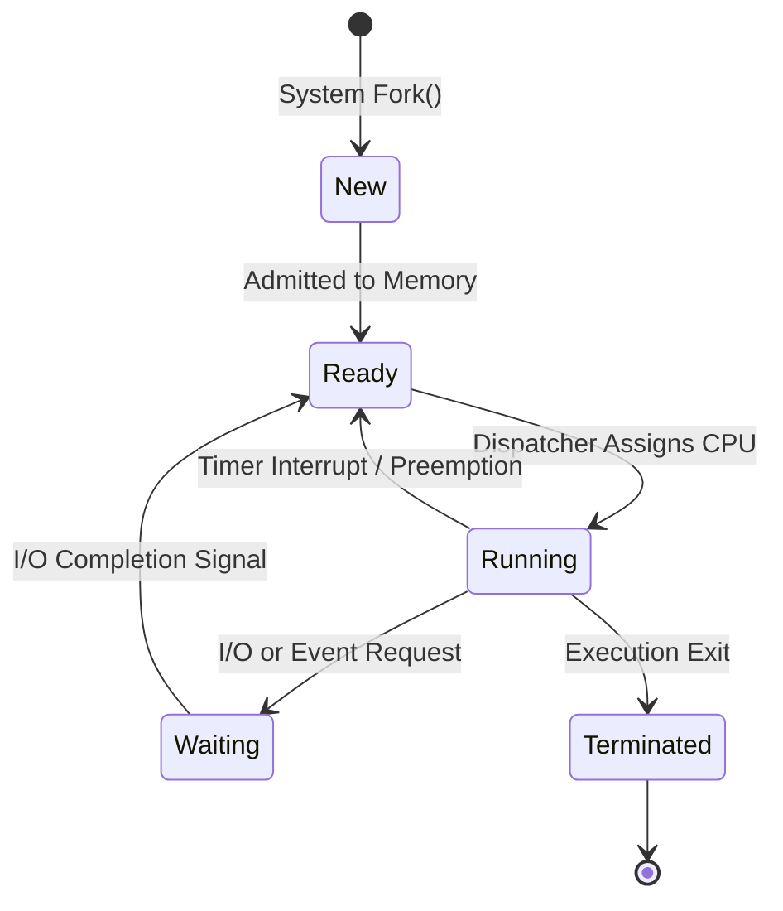
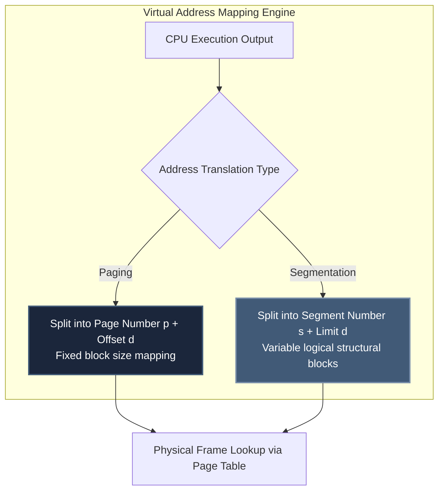

# Operating Systems Core Architecture

For an **ECE graduate**, Operating Systems provides a direct software extension to your microprocessor hardware knowledge. You already understand interrupts, system buses, and CPU clock cycles. OS introduces the logic layer that arbitrates shared access to these underlying hardware elements.

---

## 🧭 The Process State Machine Lifecycle

Understanding process transitions is mandatory to solve advanced CPU scheduling questions.

---

## ⚙️ Process Scheduling Mechanics

Examiners test scheduling by providing multi-process arrival matrices and forcing real-time calculation of **Average Turnaround Time** and **Average Waiting Time**.

### Standard Gate Scheduling Algorithms:
1. **First-Come, First-Served (FCFS):** Non-preemptive. High vulnerability to the **Convoy Effect** (short CPU bursts queued behind heavy IO tasks).
2. **Shortest Job First (SJF):** Provably optimal minimum waiting time. Preemptive version is known as **Shortest Remaining Time First (SRTF)**.
3. **Round Robin (RR):** Preemptive based on static **Time Quantum ($q$)**. 
   - *Trap:* If $q \to \infty$, RR mutates into pure FCFS. If $q \to 0$, context-switching overhead causes processing throughput collapse.

---

## 🔒 Concurrency Control & Synchronization Core

Mutual exclusion is the most mathematically rigorous module within OS. You must prove code safety states manually.

### The Critical Section Requirements:
1. **Mutual Exclusion:** Exactly one process can execute inside its critical segment at any absolute time point.
2. **Progress:** If no process is executing internally, processes wishing to enter cannot be blocked indefinitely by extraneous tasks outside the entry loop.
3. **Bounded Waiting:** A process entering the waiting queue must be guaranteed access within a bounded limit of alternate entry grants.

### Classical Problems Tracing:
- **Semaphores vs Mutexes:** Mutexes enforce ownership limits (thread locking must execute thread unlocking). Semaphores act as pure signaling integers.
- **Deadlock Conditions (Coffman):** Mutual Exclusion, Hold and Wait, No Preemption, Circular Wait. All four states must hold simultaneously. **Remedy:** Break circular wait by enforcing global resource index ordering arrays.

---

## 💾 Memory Management: Paging vs. Segmentation

GATE setters frequently construct Numerical Answer Type (NAT) problems combining virtual address spaces with physical memory boards.

### Comparative Hardware Mapping Matrix

| Memory Scheme | Block Sizing | Allocation Contiguity | Internal Fragmentation | External Fragmentation | Hardware Overhead |
| :--- | :--- | :--- | :--- | :--- | :--- |
| **Pure Paging** | Highly Fixed | Non-Contiguous Frames | **Present** (Last page drop) | **Zero** | Heavy (Page Tables) |
| **Segmentation**| Highly Variable| Contiguous Segments | **Zero** | **Present** | Medium (Base/Limit Regs) |

---

## 🛑 OS Execution Traps for GATE Prep

1. **Ignoring Context Switch Time:** When solving Round Robin scheduling arrays, setters often inject explicit overhead values (*"Assume context switch consumes $\delta=1$ ms"*). Add this delta strictly to your timeline Gantt trace blocks.
2. **Confusing TLB Hit Ratios:** Effective Access Time (EAT) formulas for paging configurations must incorporate associative cache registers (Translation Lookaside Buffers). Trace multi-level page tables step-by-step: $\text{EAT} = H \times (c + m) + (1-H) \times (c + 2m)$.
