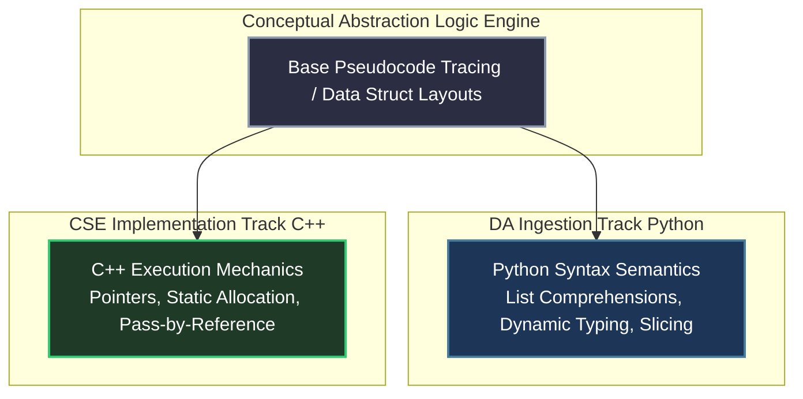

# Programming Foundations & Language Core: Python & C++

As an **ECE graduate**, transitioning from basic embedded microcontroller assembly scripts to deterministic algorithm verification requires mastering core high-level syntax semantics. GATE panels test programming competency through **execution simulation**—providing complex, recursive C/C++ or Python code structures and asking you to manually trace final output variable states or identify runtime memory crash conditions.

---

## 🐍 Dual-Language Strategy: Python (DA) vs. C++ (CSE)

You must treat language syntax as an interchangeable implementation surface layer. The authentic compilation happens at the structural abstract logic level.

---

## 🧬 Memory Mechanics & Pointer Abstraction (C++)

To solve advanced CSE recursive pointer questions seamlessly, you must understand low-level memory layout tiers exactly as physical microcontroller hardware storage arrays.

### The Stack vs. Heap Visual Map
- **Stack Allocation:** Highly static, auto-cleaned upon function frame collapse. Local variables and nested scalar parameters reside here.
- **Heap Allocation:** Dynamic memory fetched via `malloc()` or `new`. Must be explicitly managed or deallocated via `free()`/`delete` to prevent leakage.
- **Execution Traps:** GATE setters frequently pass pointers by value vs. passing pointers by reference. Trace parameter assignments explicitly on plain paper: draw internal pointer boxes labeled with unique hypothetical hexadecimal memory addresses.

---

## 🔄 Recursion Mastery Engine

Recursion is the absolute technical bottleneck for non-CS engineering transitions. If you cannot trace a 3-way recursive tree call stack mentally, you cannot successfully parse Compiler syntax parsing tables or Dynamic Programming state matrices.

### The 4-Step Call-Tree Drawing Protocol
When encountering any recursive execution block:
1. **Base Case Verification:** Box the exact return condition boundary. Trace what happens if initialization parameters match this state instantly.
2. **Pre-Order Execution State:** Trace code logic executed **before** the recursive branch splits occur.
3. **Branching Split Mapping:** Draw dedicated sub-nodes on plain paper for every internal self-call. Label passing modified parameters explicitly above connecting lines.
4. **Post-Order Return Cascade:** Trace unspooling values returned up the call tree once child nodes hit base validation bounds.

---

## 📚 Standard Template Library (STL) Core (C++)

While GATE code questions rarely import complete enterprise libraries, understanding standard container asymptotic time/space bounds dramatically accelerates optimal pseudocode formulations.

| Container Class | Internal Underlying Data Structure | Insertion Complexity | Search Complexity | Optimal GATE Application |
| :--- | :--- | :--- | :--- | :--- |
| **`std::vector`** | Dynamically Resizing Contiguous Array | $\mathcal{O}(1)$ amortized | $\mathcal{O}(1)$ index access | Base graph adjacency sets |
| **`std::stack`** | LIFO Container Adapter | $\mathcal{O}(1)$ | N/A (Top view only) | Tree iterative traversal conversions |
| **`std::queue`** | FIFO Container Adapter | $\mathcal{O}(1)$ | N/A (Front view only) | BFS Graph execution arrays |
| **`std::priority_queue`**| Binary Max/Min Heap Layout | $\mathcal{O}(\log n)$ | $\mathcal{O}(1)$ (Top retrieval) | Dijkstra / Prim's minimum tree sweeps |

---

## 🛑 Coding Anti-Patterns for GATE Prep

1. **Relying on IDE Autocomplete:** Writing code exclusively inside modern smart IDEs hides compilation error syntax traps. GATE requires absolute manual parsing. **Write all test prep logic on clean physical paper.**
2. **Ignoring Scope Rules:** Local variable shadowing inside deeply nested internal loop blocks is a high-frequency distractor technique deployed in 2-mark numerical strings. Check variable initialization scopes meticulously.
