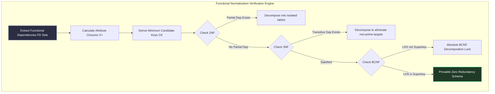
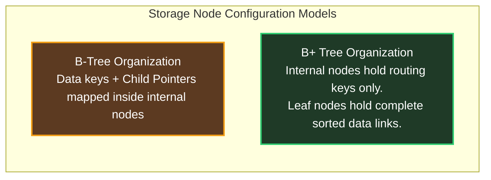

# Database Management Systems Core Architecture

For both **GATE DA and GATE CSE**, Database Management Systems acts as a highly reliable scoring anchor. The logic is strictly algebraic and structural, making it an excellent medium for **Book-First** self-study without requiring complex video explanations.

---

## 🧭 Relational Algebra & Query Translation

GATE panels test query translation by presenting nested relational algebra operations alongside SQL blocks, forcing verification of semantic equivalence.

### Standardized Relational Operators:
- **Selection ($\sigma$):** Horizontal tuple extraction based on predicate logic strings.
- **Projection ($\pi$):** Vertical column sub-setting. Automatically strips duplicate returned tuple elements.
- **Natural Join ($\bowtie$):** Automated inner cross product enforced across identical shared attribute fields.
- **Division ($\div$):** Universal quantification filter (*"Find all candidate entries who have completed all target courses"*).

---

## 🗂️ Normalization & Functional Dependency Proofs

Normalization problems test your ability to isolate functional anomalies by calculating candidate keys directly from dependency sets.

### Comparative Normal Form Matrix

| Normal Form | Required Logical Constraint | Dependency Preservation Guaranteed? | Lossless Join Guaranteed? | Primary Practical Target |
| :--- | :--- | :--- | :--- | :--- |
| **1NF** | Domain attributes must be atomic. | Yes | Yes | Baseline base relations |
| **2NF** | Zero partial dependencies on Candidate Keys. | Yes | Yes | Standard transactional logs |
| **3NF** | Zero transitive non-prime dependencies. | **Yes** | **Yes** | Industry standard balance |
| **BCNF**| Every determinant LHS must be a Superkey. | **No** (May drop constraints) | **Yes** | Absolute query isolation |

---

## 🔒 Transaction Serializability & Concurrency Control

Transaction schedules test concurrency interference limits. You must verify consistency boundaries manually.

### The Conflict Serializability Test:
1. Construct a **Precedence Graph** mapping distinct executing transactions as nodes.
2. Draw directional arrows when conflicting operations occur on shared data blocks (*Read-Write, Write-Read, Write-Write*) executed by different transactions.
3. **Validation Rule:** If the resultant graph contains zero internal cycle paths, the schedule is provably **Conflict Serializable**.

---

## 🌳 Indexing Storage Architecture: B vs. B+ Trees

Setters construct multi-stage NAT calculation arrays targeting maximum capacity scaling boundaries.

### Order Derivation Formulas ($p$):
- **Internal Routing Node (B+ Tree):** $p \times \text{PointerSize} + (p-1) \times \text{KeySize} \le \text{DiskBlockSize}$.
- **Leaf Storage Node (B+ Tree):** $p_{\text{leaf}} \times (\text{KeySize} + \text{RecordPointerSize}) + \text{SiblingPointerSize} \le \text{DiskBlockSize}$.

---

## 🛑 DBMS Execution Traps for GATE Prep

1. **Ignoring Null State Interference:** SQL aggregations behave uniquely when parsing `NULL` element states. `COUNT(*)` counts empty rows; `COUNT(column)` strips `NULL` instances before evaluation. Check data samples meticulously.
2. **Confusing View Serializability:** A schedule that fails conflict serializability can still achieve view equivalence if it contains **Blind Writes** (writing data elements without reading preceding values). Always check for blind writes before marking an un-conflict-serializable schedule false.
