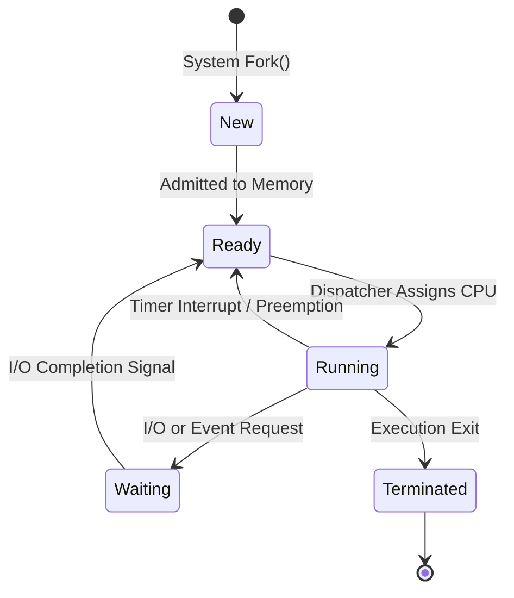
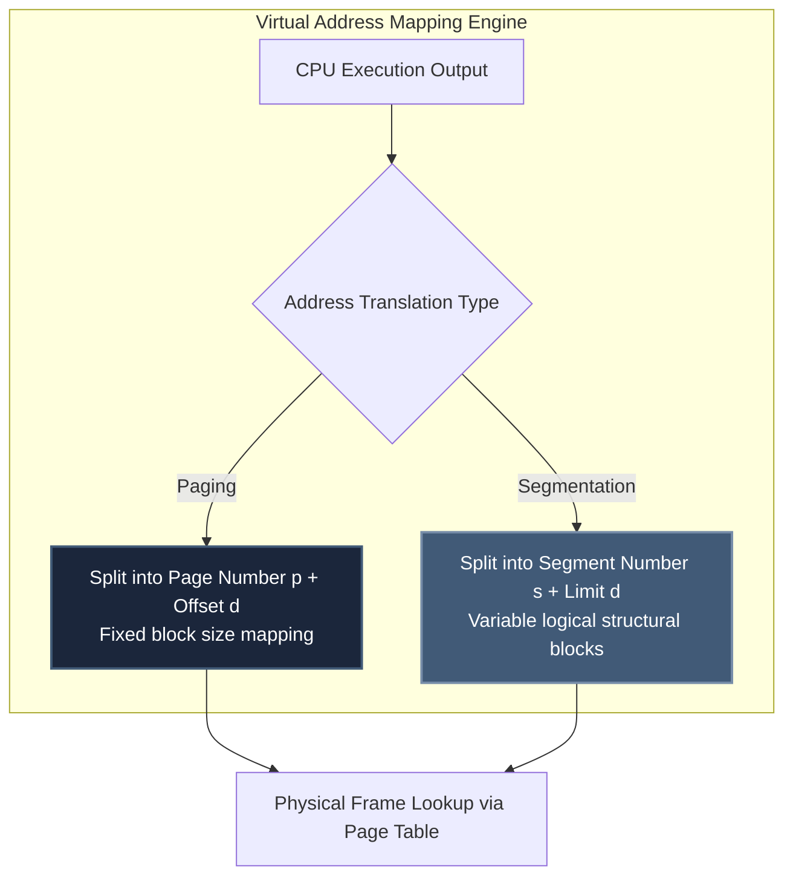

# Operating Systems Core Architecture

For an **ECE graduate**, Operating Systems provides a direct high-level software abstraction layer extending your foundational microprocessor hardware knowledge. You already possess intuitive understanding of hardware interrupts, system memory buses, and CPU clock cycles. Operating Systems introduces the logical system kernel layers that arbitrate shared access to these underlying hardware execution units.

---

## 🧭 The Process State Machine Lifecycle

Mastering process state transitions is mandatory to solve advanced multi-process CPU scheduling questions.

---

## ⚙️ Process Scheduling Mechanics

Examiners test CPU scheduling by providing multi-process arrival matrices and forcing manual real-time calculation of **Average Turnaround Time** and **Average Waiting Time**.

### Standard Gate Scheduling Algorithms:
1. **First-Come, First-Served (FCFS):** Non-preemptive. High vulnerability to the **Convoy Effect** (short CPU execution bursts queued behind heavy, slow I/O tasks).
2. **Shortest Job First (SJF):** Provably optimal minimum waiting time. Preemptive variant is known as **Shortest Remaining Time First (SRTF)**.
3. **Round Robin (RR):** Preemptive scheduling based on static **Time Quantum ($q$)**. 
   - *Trap:* If $q \to \infty$, RR mutates into pure FCFS logic. If $q \to 0$, extreme context-switching overhead causes processing throughput collapse.

---

## 🔒 Concurrency Control & Synchronization Core

Mutual exclusion is the most mathematically rigorous module within Operating Systems. You must manually prove code safety states and thread execution bounds.

### The Critical Section Requirements:
1. **Mutual Exclusion:** Exactly one process can execute inside its critical segment at any absolute time point.
2. **Progress:** If no process is executing internally, processes wishing to enter cannot be blocked indefinitely by extraneous tasks outside the entry selection loop.
3. **Bounded Waiting:** A process entering the waiting queue must be guaranteed entry access within a bounded limit of alternate entry grants.

### Classical Problems Tracing:
- **Semaphores vs Mutexes:** Mutexes enforce structural ownership limits (thread locking must execute corresponding thread unlocking). Semaphores act as pure atomic signaling integers.
- **Deadlock Conditions (Coffman):** Mutual Exclusion, Hold and Wait, No Preemption, Circular Wait. All four states must hold simultaneously. **Remedy:** Break circular wait conditions by enforcing global structural resource index ordering arrays.

---

## 💾 Memory Management: Paging vs. Segmentation

GATE setters frequently construct Numerical Answer Type (NAT) problems combining virtual address spaces with physical memory boards and cache mappings.

### Comparative Hardware Mapping Matrix

| Memory Scheme | Block Sizing | Allocation Contiguity | Internal Fragmentation | External Fragmentation | Hardware Overhead |
| :--- | :--- | :--- | :--- | :--- | :--- |
| **Pure Paging** | Highly Fixed | Non-Contiguous Frames | **Present** (Last page drop) | **Zero** | Heavy (Page Tables) |
| **Segmentation**| Highly Variable| Contiguous Segments | **Zero** | **Present** | Medium (Base/Limit Regs) |

---

## 🛑 OS Execution Traps for GATE Prep

1. **Ignoring Context Switch Time:** When solving Round Robin scheduling arrays, setters frequently inject explicit hardware overhead parameters (*"Assume context switch consumes $\delta=1$ ms"*). Add this delta strictly to your timeline Gantt block traces.
2. **Confusing TLB Hit Ratios:** Effective Access Time (EAT) formulas for multi-level paging configurations must incorporate associative cache registers (Translation Lookaside Buffers). Trace multi-level page tables step-by-step: $\text{EAT} = H \times (c + m) + (1-H) \times (c + 2m)$.
