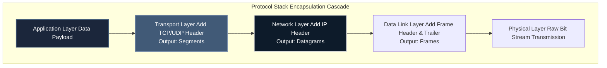
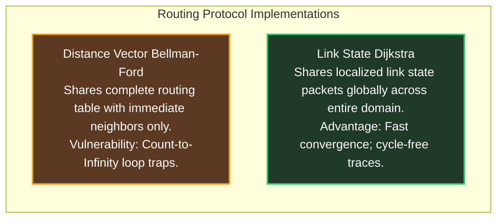

# Computer Networks Core Architecture

For an **ECE graduate**, Computer Networks bridges physical bit transmission layers (which you studied deeply in digital communications and signal processing) to application software interfaces. You already possess intuitive understanding of channel capacity, Shannon limits, and physical line coding protocols. Computer Networks introduces the layered encapsulation logic that navigates these dynamic packet-switched routing networks.

---

## 🏛️ Layered Encapsulation Architecture

GATE testing focuses heavily on header byte lengths appended at each descending transmission stack layer and the impact of encapsulation overhead on channel capacity.

---

## 🌊 Flow Control Mechanics: Sliding Window Protocols

Throughput optimization calculations are a high-frequency source of complex 2-mark Numerical Answer Type (NAT) arrays.

### Channel Efficiency Definitions ($a$):
Let $T_t = \frac{\text{PacketSize}}{\text{Bandwidth}}$ be transmission delay, and $T_p = \frac{\text{Distance}}{\text{PropagationSpeed}}$ be propagation delay. Define $a = \frac{T_p}{T_t}$.

### Protocol Efficiency Comparisons:
1. **Stop-and-Wait ARQ:** Window Size $W=1$. Efficiency $\eta = \frac{1}{1+2a}$. 
   - *Result:* Horrendous utilization on long fat networks (high bandwidth-delay product channels).
2. **Go-Back-N (GBN) ARQ:** Sender Window $W_s = N$, Receiver Window $W_r = 1$. Efficiency $\eta = \frac{N}{1+2a}$.
   - *Constraint:* Maximum permissible sequence numbers must satisfy $N \le 2^m - 1$ to prevent overlapping packet boundary confusion.
3. **Selective Repeat (SR) ARQ:** Sender Window $W_s = N$, Receiver Window $W_r = N$. Efficiency $\eta = \frac{N}{1+2a}$.
   - *Constraint:* Maximum window scaling requires $W_s + W_r \le 2^m \implies W_s \le 2^{m-1}$.

---

## 🌐 IP Addressing & Subnet Masking (IPv4)

Examiners test addressing by supplying raw IP/Mask strings and forcing manual derivation of network broadcast paths and viable host assignments.

### The Subnetting Algorithm:
1. Convert the custom decimal subnet mask string directly into contiguous binary arrays.
2. Count the number of leading `1` bits to establish the **Network Prefix Length ($n$)**.
3. The remaining $32-n$ bits represent the variable **Host Identification Field**. Total viable assignable hosts per subnet is exactly $2^{32-n} - 2$ (stripping the base network ID and terminal broadcast IP).

---

## 🔀 Dynamic Routing Logic: Distance Vector vs. Link State

---

## 🛑 CN Execution Traps for GATE Prep

1. **Ignoring Byte Padding Limits:** Ethernet frames enforce a strict **Minimum Payload Size of 46 Bytes** (total frame size 64 bytes). If an upper application layer passes a tiny data packet, physical interface cards automatically append padding strings. Account for this excess weight when calculating channel payload throughput.
2. **Confusing TCP Checksum Coverage:** The TCP checksum calculation covers the pseudo-header (extracted IP addresses), the TCP base header, and the underlying application data payload. Verify protocol field inclusion statements.
