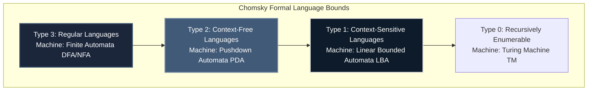
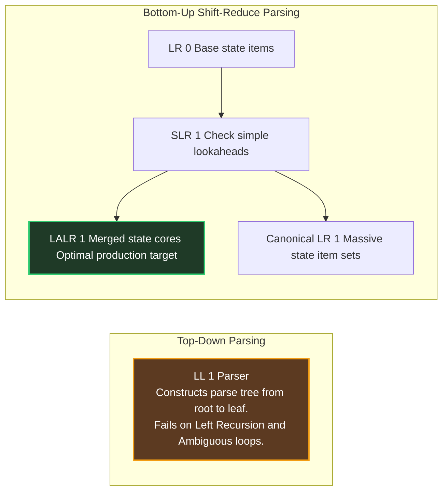

# Theoretical CS Architecture: TOC & Compiler Design

Theory of Computation (TOC) combined with Compiler Design acts as the ultimate deterministic scoring capstone within **GATE CSE 2028**. The underlying logic relies strictly on state machine abstractions, formal mathematical assertions, and grammar string rewrites, making it exceptionally fast to trace, compute, and verify under timed parameters.

---

## 🏛️ The Chomsky Hierarchy of Formal Languages

Understanding absolute closure bounds across formal language classes is mandatory to resolve advanced multi-select True/False assertions.

### Comprehensive Closure Property Matrix

| Language Class | Union | Intersection | Complementation | Concatenation | Kleene Star | Homomorphism |
| :--- | :--- | :--- | :--- | :--- | :--- | :--- |
| **Regular** | **Closed** | **Closed** | **Closed** | **Closed** | **Closed** | **Closed** |
| **DCFL** | Not Closed | Not Closed | **Closed** | Not Closed | Not Closed | Not Closed |
| **CFL** | **Closed** | Not Closed | Not Closed | **Closed** | **Closed** | **Closed** |
| **Rec. Enum** | **Closed** | **Closed** | Not Closed | **Closed** | **Closed** | **Closed** |

---

## ⚙️ Compiler Design Parsing Mechanics

Compiler parsing algorithms translate formal context-free grammars directly into deterministic state routing matrices.

### Grammar Verification Protocols:
1. **Left Recursion Strip:** Grammars formatted as $A \to A\alpha \mid \beta$ cause top-down LL parsers to enter infinite expansion paths. Rewrite as right-recursive equivalent strings: $A \to \beta A'$ and $A' \to \alpha A' \mid \epsilon$.
2. **Left Factoring:** Resolve predictive non-determinism when shared production prefixes occur: $A \to \alpha\beta_1 \mid \alpha\beta_2 \implies A \to \alpha A'$ and $A' \to \beta_1 \mid \beta_2$.

---

## 🛑 TOC & Compiler Execution Traps

1. **Confusing Subset Grammars:** Every regular language is automatically a context-free language. If a grammar generates strings that can be processed without using infinite memory stack boards, the underlying language is regular, even if the grammar string utilizes context-free derivation rules. Check minimal state machine generation capability first.
2. **Ignoring Precedence Rules:** When resolving Shift-Reduce conflicts inside bottom-up parsing tables, operators with higher mathematical precedence always trigger an immediate **Reduce** action over a pending Shift. Trace operator evaluation strings explicitly.
