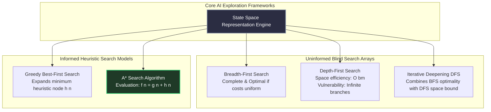

# Artificial Intelligence & Reasoning Architecture

Within **GATE DA 2027**, Artificial Intelligence acts as a deterministic algorithmic bridge. Examiners test AI primarily through **search space tracing**—providing explicit tree structures or graph configurations with customized heuristic costs and demanding step-by-step resolution of optimal goal paths.

---

## 🏛️ Search Algorithm Execution Topologies

---

## 🔬 A* Search Heuristics: Admissibility vs. Consistency

To resolve advanced theoretical True/False MSQs, trace the specific mathematical guarantees enforced by heuristic bounding parameters.

### 1. Admissibility Condition (Optimality Guarantee in Trees)
- **Mathematical Definition:** A heuristic $h(n)$ is provably **admissible** if it never overestimates the actual minimal path cost to reach the target goal state from node $n$: $\forall n, \ h(n) \le h^*(n)$, where $h^*(n)$ is the true exact minimum cost.
- **GATE Execution Protocol:** If an evaluation configuration uses an admissible heuristic, tree search expansions are mathematically guaranteed to return the optimal minimal path.

### 2. Consistency / Monotonicity Condition (Optimality Guarantee in Graphs)
- **Mathematical Definition:** A heuristic $h(n)$ is provably **consistent** if, for every node $n$ and every successor $n'$ generated by action $a$, the estimated cost of reaching the goal from $n$ is no greater than the step cost of getting to $n'$ plus the estimated cost of reaching the goal from $n'$: $h(n) \le c(n, a, n') + h(n')$, alongside terminal goal state bounds $h(\text{Goal}) = 0$.
- **Structural Consequence:** Every consistent heuristic is automatically admissible. If a graph configuration utilizes a consistent heuristic, the evaluation function values $f(n)$ along any execution branch are strictly non-decreasing. A* search on graphs with consistent heuristics never reopens expanded nodes.

---

## 🧠 Propositional Logic & Knowledge Representation

Setters evaluate AI logic capability by forcing translation of real-world strings into formal resolution proofs.

### Standardized Propositional Equivalences:
- **Implication Elimination:** $P \implies Q \iff \neg P \lor Q$.
- **Biconditional Expansion:** $P \iff Q \iff (P \implies Q) \land (Q \implies P)$.
- **De Morgan's Transformation:** $\neg(P \land Q) \iff \neg P \lor \neg Q$.

### The Resolution Proof Algorithm:
1. Translate all given knowledge base assertions into **Conjunctive Normal Form (CNF)**.
2. Negate the target assertion statement you wish to prove. Append this negated string directly to your CNF base.
3. Apply structured resolution steps iteratively: resolve complementary pairs ($P$ and $\neg P$) to produce resolvent outputs.
4. **Validation Lock:** If the resolution process generates an **empty clause ($\text{Box } \square$)**, the original negated state is mathematically impossible, proving the initial target assertion true.

---

## 🛑 AI Execution Traps for GATE Prep

1. **Ignoring Tie-Breaking Logic:** When tracing A* tree expansions on paper, multiple child nodes may evaluate to identical minimum cost values $f(n)$. Setters often define explicit tie-breaking rules (*"Resolve alphabetical node ties by selecting the rightmost path"*). Follow explicit custom instructions to trace final visited node sequences.
2. **Confusing State Space Sizing with Hardware Memory Bounds:** While Depth-First Search scales cleanly inside linear memory limits ($\mathcal{O}(bm)$), Breadth-First Search and A* store complete exploration frontiers inside active memory arrays ($\mathcal{O}(b^d)$). Check memory hardware limitations when calculating permissible depth traversals.
