# Core Data Structures Architecture: GATE Base

Data Structures acts as the vital shared bridge across both **GATE DA 2027 and GATE CSE 2028**. It tests structural data configurations, physical memory address calculations, and pointer layout access patterns under strict execution simulation bounds.

---

## 🏛️ Structural Layout Models

```mermaid
graph TD
    subgraph Contiguous Memory Allocation Arrays
        Static[Static Dimensional Indexing<br>Access Complexity: O 1]
    end

    subgraph Dynamic Linked Layouts
        Singly[Singly Linked Array Pointers] --> Doubly[Doubly Linked Bi-Directional Traces]
        Doubly --> Circular[Circular Infinite Traversal Paths]
    end

    subgraph Abstract Data Types Container Wrappers
        LIFO[Stacks Push/Pop] --> FIFO[Queues Enqueue/Dequeue]
    end

    subgraph Non-Linear Routing Arrays
        Trees[Binary Search Trees BST / AVL] --> Hashing[Chained / Open Addressed Hash Maps]
    end

    style Static fill:#2b2d42,stroke:#8d99ae,stroke-width:2px,color:#fff
    style Singly fill:#1d3557,stroke:#457b9d,stroke-width:2px,color:#fff
    style Trees fill:#1f3a27,stroke:#2ecc71,stroke-width:2px,color:#fff
```

---

## 🔬 Core Structures & Algorithmic Complexities

### 1. Arrays & Matrix Indexing
- **Address Derivations:** Row-Major vs Column-Major mappings. 
- **Formula (Row-Major 2D Matrix):** $\text{Addr}(A[i][j]) = \text{BaseAddress} + \text{ElementSize} \times ((i - \text{LowerBound}_r) \times \text{TotalColumns} + (j - \text{LowerBound}_c))$.
- **GATE Execution Trap:** Watch for asymmetrical boundary scaling where internal matrices use 1-indexed origins instead of standard 0-indexed bounds.

### 2. Linked Lists
- **Mastery Parameters:** Pointer manipulation, head/tail assignment loops, middle element retrieval without complete secondary traversals (Floyd’s fast/slow pointer algorithms).
- **Execution Rule:** Never write a line of linked-list pseudocode without simultaneously drawing internal memory block nodes on plain paper. Box exact pointer connection strings before updating target link assignments.

### 3. Stacks & Queues
- **Implementations:** Array-backed resizing wrappers vs direct pointer-linked nodes.
- **GATE Testing Arrays:** Validating parenthesis balanced structures, Evaluating Postfix/Prefix notation strings, converting Infix mathematical expressions to abstract syntax trees.

### 4. Trees (BST, AVL, Heaps)
- **Binary Search Trees (BST):** Inorder traversal always yields sorted key output arrays. Worst-case search complexity collapses to $\mathcal{O}(n)$ if input insertion arrays arrive pre-sorted (degrading into pure skewed linked chains).
- **AVL Trees:** Self-balancing via strict **Balance Factor ($BF \in \{-1, 0, 1\}$)** constraints. Enforces $\mathcal{O}(\log n)$ insertion height maintenance via Single (*LL/RR*) and Double (*LR/RL*) structural pointer rotations.
- **Binary Heaps:** Complete binary trees stored inside contiguous arrays. Parent node at index $i$ maps children directly at $2i+1$ and $2i+2$. **Priority Queue** backing engine.

### 5. Hashing Architecture
- **Collision Resolution:** Chained bucket arrays vs Open Addressing strategies (Linear Probing, Quadratic Probing, Double Hashing).
- **Load Factor ($\alpha$):** $\alpha = \frac{\text{TotalStoredKeys}}{\text{TotalBucketSlots}}$. 
- **The Pitfall:** Deleting an element from an open-addressed table breaks regular probing sequences for alternate colliding keys. Must insert explicit **Tombstone markers** to maintain valid secondary search loops.

---

## 📋 Comprehensive Time-Complexity Summary

| Data Structure | Search (Avg) | Search (Worst) | Insertion (Avg) | Deletion (Avg) | Primary Vulnerability |
| :--- | :--- | :--- | :--- | :--- | :--- |
| **Sorted Array** | $\mathcal{O}(\log n)$ | $\mathcal{O}(\log n)$ | $\mathcal{O}(n)$ shifting | $\mathcal{O}(n)$ shifting | Contiguous reallocations |
| **BST** | $\mathcal{O}(\log n)$ | $\mathcal{O}(n)$ skewed | $\mathcal{O}(\log n)$ | $\mathcal{O}(\log n)$ | Degrades on pre-sorted data |
| **AVL Tree** | $\mathcal{O}(\log n)$ | $\mathcal{O}(\log n)$ | $\mathcal{O}(\log n)$ | $\mathcal{O}(\log n)$ | Heavy pointer rotation logic |
| **Hash Table** | $\mathcal{O}(1)$ | $\mathcal{O}(n)$ collision | $\mathcal{O}(1)$ | $\mathcal{O}(1)$ | Bad hashing hash distributions |
