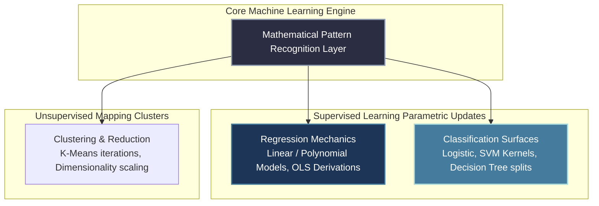
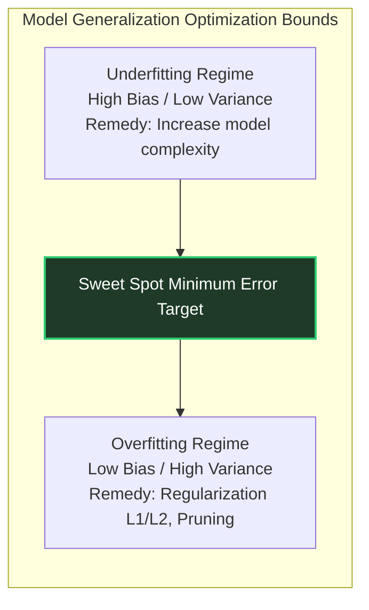

# Machine Learning Core Architecture: GATE DA Peak

Machine Learning represents a high-yield technical module within **GATE DA 2027 and 2028**. Examiners test Machine Learning not by asking for simple code library API calls, but by demanding **mathematical traces** of loss function gradients, internal optimization matrix updates, and multi-dimensional spatial structural transformations.

---

## 🏛️ Macro Algorithmic Classifications

---

## 🔬 Core Algorithms & Mathematical Formulations

### 1. Linear Regression & Ordinary Least Squares (OLS)
- **Hypothesis Function:** $h_\theta(x) = \theta^T x$.
- **Mean Squared Error (MSE) Loss:** $J(\theta) = \frac{1}{2m} \sum_{i=1}^m (h_\theta(x^{(i)}) - y^{(i)})^2$.
- **Closed-Form Normal Equation:** $\theta = (X^T X)^{-1} X^T y$. 
  - *Constraint:* Matrix $X^T X$ must be invertible (non-singular). Fails if highly redundant feature correlations cause severe multicollinearity.
- **Gradient Descent Update:** $\theta_j := \theta_j - \alpha \frac{1}{m} \sum_{i=1}^m (h_\theta(x^{(i)}) - y^{(i)}) x_j^{(i)}$.

### 2. Logistic Regression & Classification Surfaces
- **Sigmoid Mapping:** $g(z) = \frac{1}{1 + e^{-z}}$. Bounds target predictions within strict probability range $(0,1)$.
- **Binary Cross-Entropy Loss:** $J(\theta) = -\frac{1}{m} \sum_{i=1}^m \left[ y^{(i)} \log(h_\theta(x^{(i)})) + (1-y^{(i)}) \log(1-h_\theta(x^{(i)})) \right]$.
- **Execution Trap:** Logistic regression constructs a **strictly linear decision boundary** in the input feature space unless non-linear polynomial expansion mappings are explicitly applied to features before model evaluation.

### 3. Support Vector Machines (SVM)
- **Optimization Target:** Maximizing the geometric margin $\gamma = \frac{2}{\|w\|}$ subject to functional margin bounding constraints $y^{(i)}(w^T x^{(i)} + b) \ge 1$.
- **Soft Margin formulation:** Incorporates slack variables ($\xi_i$) scaled by hyper-parameter $C$. 
  - *Result:* High $C$ enforces zero training misclassifications (high variance, risk of overfitting). Low $C$ allows boundary exceptions (high bias, smooth boundaries).
- **The Kernel Trick:** Maps continuous linear dot products directly into infinite-dimensional feature spaces via kernel functions (RBF, Polynomial) to flawlessly resolve non-linearly separable datasets.

### 4. Decision Trees & Ensemble Basics
- **Splitting Criteria:** Maximizing Information Gain ($IG$) derived from internal Entropy reductions: $H(S) = -\sum p_i \log_2(p_i)$, or minimizing Gini Impurity: $I_G(p) = 1 - \sum p_i^2$.
- **Overfitting Prevention:** Enforcing maximum depth bounds, minimum sample counts per node split, and explicit post-pruning traversal routines.

### 5. K-Means Clustering Algorithm
- **Objective:** Minimizing Within-Cluster Sum of Squares (WCSS) distance metrics.
- **Execution Trace:** Alternate between **Expectation** (assigning data points to closest centroids) and **Maximization** (updating centroid spatial locations to internal component coordinate averages). Provably converges to localized minimum states.

---

## 📈 The Bias-Variance Decomposition Framework

To solve advanced multi-select conceptual MSQs, trace exactly how algorithmic hyper-parameters push models across the Generalization Curve.

### Regularization Impact ($L_1$ vs $L_2$):
- **$L_1$ (Lasso):** Appends absolute weight penalties $\lambda \sum |w_j|$. Drives non-critical feature parameters to **exactly zero**, enabling automated feature extraction.
- **$L_2$ (Ridge):** Appends squared weight penalties $\lambda \sum w_j^2$. Distributes structural weights smoothly across correlated variables without dropping dimensions entirely.

---

## 🛑 ML Execution Traps for GATE Prep

1. **Ignoring Feature Scaling:** Gradient Descent converges exponentially slower on unscaled multidimensional feature spaces (highly elliptical loss contours). Standardize features ($\frac{x-\mu}{\sigma}$) to transform contours into uniform circular geometries. Account for feature transformations explicitly in manual calculation strings.
2. **Confusing Validation Sets with Testing Arrays:** Model hyper-parameter tuning happens exclusively inside validation data distributions. Testing subsets must remain completely untouched until terminal verification checks. Ensure absolute boundary logic separation.
