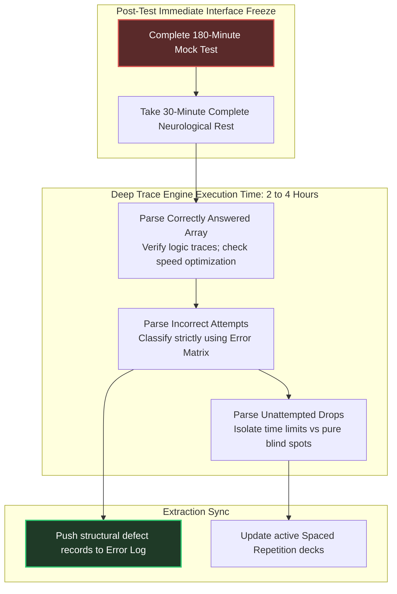

# Test Series Execution & Deep Post-Mortem Architecture

To secure an **AIR under 100**, writing a mock test is simply the data collection phase. The actual optimization occurs during the **Deep Post-Mortem Analysis**. 

Amateur candidates glance at their percentile and exit the platform; elite candidates execute a highly structured, multi-hour parsing loop to extract every underlying conceptual and execution failure mode.

---

## 🧭 Post-Test Traversal Flow



---

## 📋 The Granular Review Checklist

For every single question processed during your review session, execute this specific linear protocol before moving to the next array element.

### Phase 1: Correct Attempts Audit
- [ ] Did I solve this question using the provably optimal minimum path, or did I rely on brute-force time-sink iterations?
- [ ] Did I guess between two options? *(If yes, treat this question as an incorrect attempt; log the ambiguous logic link)*.
- [ ] Can this specific problem configuration be solved instantly using inverse boundary values or dimensional checks?

### Phase 2: Incorrect Attempts Audit
- [ ] Map the exact drop class: `ERR_CONCEPT`, `ERR_CALC`, `ERR_PARSE`, or `ERR_ENTRY` ([07_mock_test_strategy.md](./07_mock_test_strategy.md)).
- [ ] Trace your physical scribble pad. Isolate exactly where your visual line trace dropped a sub-step output.
- [ ] Write down the complete step-by-step logic path in your **Master Defect Registry**.

### Phase 3: Unattempted / Skipped Questions Audit
- [ ] Was this question dropped due to raw time expiration? *(If yes, review preceding question traces to identify time-sink bottlenecks)*.
- [ ] Was this question dropped due to encountering a completely unknown theoretical theorem exception? *(If yes, extract source reference pages; compile localized short notes)*.

---

## 📈 Performance Tracking Curves

To track your trajectory toward the top 100, maintain this specific offline visualization matrix across consecutive mock executions.

```mermaid
graph LR
    subgraph Execution Metrics Trajectory
        Mocks[Mock Progression Timeline] --> Volatile[Phase 1: Volatile Ingestion<br>Accuracy: 70-80% | High Calc Drops]
        Volatile --> Compounding[Phase 2: Error Compression<br>Accuracy: 85-90% | Zero Calc Drops]
        Compounding --> Elite[Phase 3: Sub-100 Elite Precision<br>Accuracy: >92% | Negative Bleed < 2 Marks]
    end

    style Elite fill:#1f3a27,stroke:#2ecc71,stroke-width:2px,color:#fff
```

---

## 🛑 Critical System Traps

1. **Reviewing Answers Immediately Post-Test:** Attempting to review complex test arrays while your prefrontal cortex is completely fatigued from a 180-minute sit guarantees shallow surface processing. **Enforce a strict 30-minute physical break before launching post-mortem parsing loops.**
2. **Deleting "Too Hard" Questions:** Skipping reviews of deeply complex MSQs under the assumption that *"GATE will never ask something this tough"* is a dangerous comfort mechanism. Setters frequently use extremely difficult test-series problems as structural templates for subsequent final exam iterations. Trace every single step.
