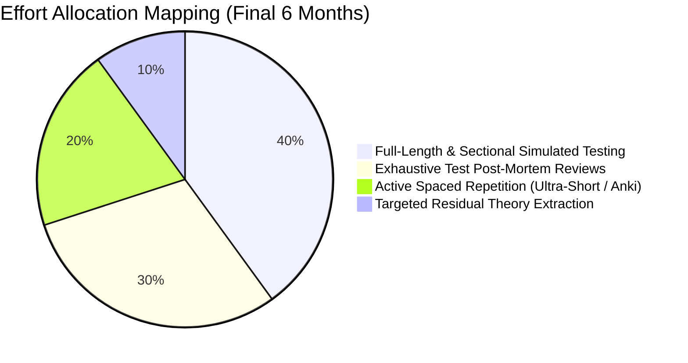
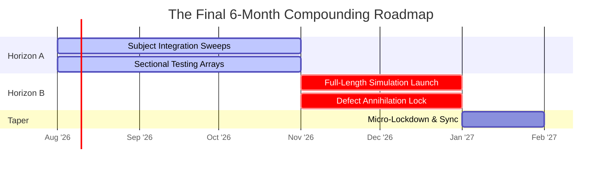

# Final 6-Month Strategy: Compounding Testing & Revision Pivot

Entering the final 6-month horizon marks the transition from broad theoretical discovery to focused **Performance Compounding**. 

By this stage, your baseline primary reading should be largely complete. Attempting to ingest heavy new narrative textbooks within this window creates cognitive friction and compromises retention velocity.

---

## 🏛️ Macro Operational Focus Shift

---

## 🧭 The Multi-Tier Horizon Integration

Your remaining two quarters are split into distinct functional intensification blocks.

---

## 🗓️ Operational Action Plan

### 1. Subject Integration Phase (Months 6 to 4 Prior)
- **Primary Objective:** Transitioning from isolated single-chapter comprehension to integrated multi-subject problem solving.
- **Weekday Desk Routine:** Strip fresh textbook reading down to an absolute minimum. Dedicate weekday desk blocks strictly to executing 45-minute multi-topic sectional tests.
- **Transit Engine:** Continuous mobile verification of compiled **Layer 1 Short Notes** and structural block diagrams.

### 2. Full-Length Compounding Phase (Months 3 to 2 Prior)
- **Primary Objective:** Developing biological endurance to sustain absolute computational precision across standard 180-minute constraints.
- **Weekend Execution:** Execute exactly **one Full-Length Mock Test every Sunday** under complete physical isolation rules. Spend full Saturdays mapping root-cause defects directly into your database.
- **Transit Engine:** Shift commute ingestion exclusively to scanning **Layer 2 Ultra-Short Revision Sheets** and pure inverse formula cards.

### 3. Defect Annihilation Lock (Final Month Prior)
- **Primary Objective:** Complete elimination of unforced execution errors and interface calculation drops.
- **Strategic Actions:** Review the **Error Log System** PDFs exhaustively. Verify counter-example logic strings on plain sheets. Terminate all new Full-Length testing exactly **7 days prior** to the target exam window to secure emotional stability.

---

## 🛑 Critical System Traps

1. **Attempting Major New Syllabus Acquisitions Late:** If an entire complex peripheral module (*e.g., secondary COA bus architectures*) remains completely unread entering the final 60 days, **do not attempt to read the primary textbook.** Deploy **Debt Compression Mechanics** ([08_backlog_recovery.md](./08_backlog_recovery.md)) to extract the absolute minimal scoring core via top-tier PYQs, or completely abandon the sub-topic to protect core scoring engines.
2. **Ignoring Physical Interface Friction:** Practicing final phase calculations exclusively on lined notebooks creates spatial adjustment errors when presented with standard plain scribble pads inside physical exam centers. **Enforce plain A4 sheet scratchpad usage strictly across the entire final 6-month block.**
