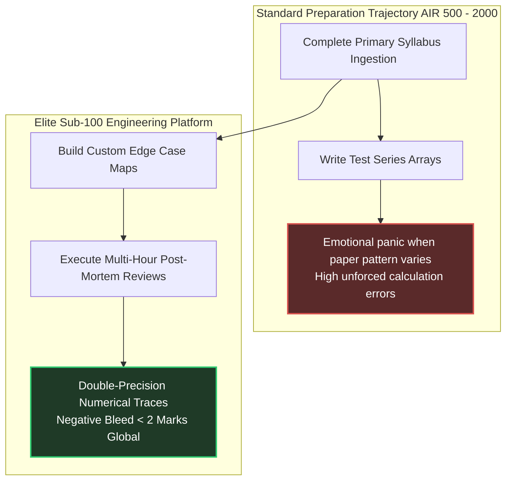

# Elite Rank Scaling Architecture: Bridging Sub-100 Trajectories

Securing a baseline top-1000 score in GATE requires broad syllabus completion. Scaling from a top-1000 score to an **All India Rank (AIR) under 100** requires an absolute transformation in execution philosophy across both target streams. 

Top-100 candidates do not possess secret source materials; they possess **unshakeable emotional temperament, automated mistake avoidance loops, and double-precision mathematical validation protocols.**

---

## 🏛️ The Sub-100 Differentiator Matrix

---

## 🔬 Core Differentiators: Average vs. Sub-100 Execution

| Execution Dimension | Top 1000 Baseline Candidate | Sub-100 Elite Candidate |
| :--- | :--- | :--- |
| **Handling MSQs** | Scans options for the first correct assertion and moves on. | Evaluates every single option as an isolated **True/False theorem proof**. |
| **Scribble Pad Layout** | Cluttered, unindexed numeric strings. High visual trace errors. | Clean modular blocks. Target units explicitly boxed next to outputs. |
| **Interface Navigation** | Solves linearly. Encounters an early time-sink trap and loses emotional poise. | Deploys the **3-Pass Attempt Algorithm**. Bypasses ego-driven calculations instantly. |
| **Revision Frequency** | Rereads source text only before scheduled major testing blocks. | Spaced Repetition Engine executes automated **1-7-21-30 day active recall sweeps**. |
| **Concept Integration** | Understands chapters as isolated functional silos. | Maps direct interdependencies (*e.g., parsing table shift-reduce logic mapped to TOC pushdown automata*). |

---

## 🎯 Target Performance Calibration Bounds

To guarantee double-digit placement, your offline performance dashboard must systematically converge on these precise execution metrics across final-phase testing matrices.

### Metric 1: The Attempt/Accuracy Threshold
- **GATE DA Target:** Attempted value $>92\%$. Accuracy ratio $>92\%$. Raw net score consistently $>82/100$.
- **GATE CSE Target:** Attempted value $>88\%$. Accuracy ratio $>90\%$. Raw net score consistently $>76/100$.

### Metric 2: Absolute Negative Bleed Throttling
- Every mark lost strictly to negative penalties drops your final national rank by **~40 to 80 positions** within highly concentrated top-tier score bands.
- **Mandatory Ceiling:** Maximum permissible negative bleed per complete 100-mark paper is exactly **2.0 Marks**. If negative bleed breaches this limit, enforce a mandatory review penalty block where you write out counter-example paths for every dropped question ten times.

---

## 🛡️ Psychological Temperament Calibration

GATE setters deliberately design question papers with non-linear difficulty spikes. Questions 1 to 5 may contain deeply complex multi-step COA or optimization derivations to induce limbic panic.

### The Ego-Bypass Protocol
If a problem path does not yield clear intermediate validation states within **3.5 minutes**, execute an immediate hard disengagement. 
- **Internal Command:** *"This question is designed to act as a psychological filter. By skipping it now, I am extracting higher value from subsequent simple scoring questions while my competitors destroy their time budgets."*
- Tag the question string for review and jump forward instantly. Return to trace the complex loop during the residual pass blocks once baseline passing scores are fully secured.
