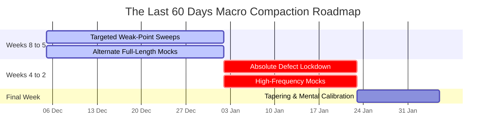

# The Last 60 Days Strategy: Extreme Focus & Defect Isolation

The final 60 days represent the ultimate high-pressure compaction phase across both targeted exam streams. By this stage, theoretical acquisition is fully locked. Your single operational goal is converting accumulated technical knowledge into absolute execution precision under strict testing simulation constraints.

---

## 🏛️ Tactical Horizon Architecture

---

## 🧭 Operational Directives

### Directive I: Targeted Weak-Point Eradication (Weeks 8 to 5)
- **Execution Mechanism:** Extract the specific sub-topics tagged with recurring `ERR_CONCEPT` and `ERR_LOGIC` codes in your **Master Defect Registry**.
- **Action:** Dedicate your 1-hour weekday desk blocks strictly to reviewing counter-examples and direct step-by-step mathematical proofs for those isolated weak paths. **Do not waste desk time reviewing material where your accuracy exceeds 90%.**

### Directive II: The High-Frequency Mock Testing Array (Weeks 4 to 2)
- **Testing Frequency:** Execute exactly **two Full-Length Mock Tests weekly** (e.g., Wednesday morning shift and Sunday morning shift, alternating target streams as necessary).
- **Post-Mortem Commitment:** Reserve a minimum of **3 to 4 hours** following every single attempt to execute exhaustive root-cause analytical sweeps. Trace every dropped digit.

### Directive III: Asynchronous Commute Lockdown
- **Operational Boundary:** Your **2-hour weekday commute** is weaponized exclusively for continuous scanning of **Layer 2 Ultra-Short Revision Sheets** and pure inverse formula flashcard decks. 
- **Rule:** Strip out all background audio podcasts or generalized conceptual reads. Force immediate recall loops.

---

## 🛑 Critical System Traps

1. **Panic-Induced Resource Hoarding:** Entering the final 60 days, candidates frequently panic and download external test series bundles or third-party revision notes packs. **This introduces catastrophic mental clutter.** Rely strictly on your own compiled notes layers.
2. **Ignoring Time-of-Day Rhythms:** If your official Admit Card indicates an afternoon exam slot (14:30 - 17:30), immediately transition your weekend full-length testing blocks to align perfectly with that absolute window. **Train your circadian baseline to achieve peak cognitive output during exact target panel hours.**
