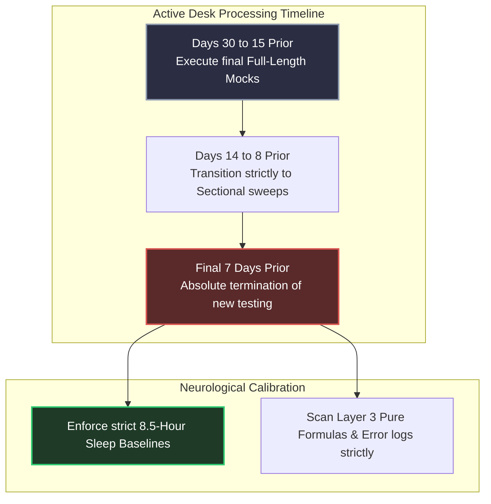

# The Last 30 Days Strategy: Tapering Lockdown & Neurological Calibration

The final 30 days mark the ultimate operational taper across both target exam cycles. Pushing your central nervous system into physical or cognitive exhaustion within this window guarantees memory retrieval failures during live paper execution. 

This protocol focuses strictly on **Biological State Maintenance, Absolute Defect Annihilation, and Emotional Stabilization.**

---

## 🏛️ The Tapering Execution Profile

---

## 🧭 Operational Action Plan

### 1. Final Testing Freeze (7-Day Hard Limit)
- **Mandatory Directives:** Terminate all Full-Length mock test simulations exactly **7 days before** the respective target exam date. 
- **Rationale:** A low score or anomalous difficulty set encountered just days before the exam triggers massive limbic cortisol releases, destroying prefrontal confidence baselines. Sit with your compiled successes.

### 2. The Formula Lock (Desk Sessions)
- **Execution Workflow:** Dedicate morning desk blocks strictly to reviewing your **Formula Notebooks**. On blank A4 paper, write out complex matrix properties, statistical inference intervals, and structural normalization bounds from pure memory. Verify against your master sheets immediately.

### 3. The Scribble Pad Rehearsal
- Ensure your physical desk arrays mimic exact exam configurations. Practice drawing bounded multi-pass blocks. Box target units explicitly next to numeric output paths to eliminate last-stage entry drops.

---

## 🛑 Critical System Traps

1. **Attempting Last-Minute Theoretical Cramming:** Reading newly discovered concepts or peripheral theory PDFs during the final 30 days yields near-zero retention while inducing acute psychological fatigue. **Trust your existing short notes layer absolutely.**
2. **Disrupting Circadian Rhythms:** Ensure your body wakes up naturally without alarm-clock friction at least 2 hours before your final exam slot time. Establish this uniform physical baseline systematically throughout the entire final month.
