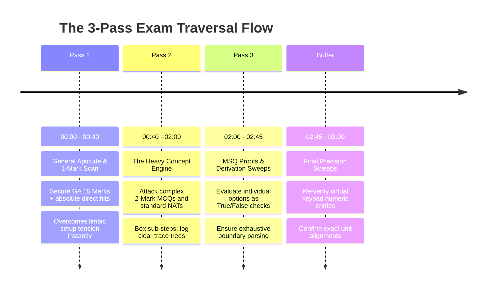

# Exam Day Strategy: 180-Minute Paper Navigation & Interface Efficiency

The day of the exam tests emotional control and spatial interface efficiency above pure intellectual recall. You are stepping into a highly monitored physical environment under absolute 180-minute constraints across your target streams. 

This protocol establishes the exact behavioral operations required to secure maximum marking yield while eliminating unforced physical dropouts.

---

## 🧭 The 180-Minute Execution Blueprint

Never attempt a GATE paper linearly from Question 1 to 65. Setters strategically position complex, high-friction questions early to induce panic. You must execute an **Asymmetric Multi-Pass Attempt Algorithm**.

---

## 🖥️ Virtual Interface Efficiency & Scribble Pad Logistics

### 1. Scribble Pad Layout Architecture
- **Physical Integration:** You are provided with a bounded scribble pad. **Do not write unformatted numeric strings.** Divide individual sheets into clear quadrant grids using your pen before solving.
- **Variable Tagging:** Boldly mark target output units (*e.g., [Mbps], [Bytes]*) next to intermediate answers to ensure zero final conversion inversions.

### 2. Interface Feature Utilization
- **Virtual Calculator Multi-Tap Guard:** The digital interface calculator experiences input latency. Always click keys slowly and verify registered input strings directly on screen before executing calculation commands.
- **Status Color Filtering:** Use review tagging explicitly. If an assertion string takes longer than **4 minutes** without yielding a clear mathematical path, mark it for review and jump instantly to protect downstream time reserves.

---

## 🧠 Acute Anxiety Protocol

If you encounter an unexpected string of highly difficult questions causing autonomic arousal (tremors, visual blurring, accelerated heart rate):
1. **Hard Freeze:** Remove your hands completely from the mouse and keypad interface.
2. **Visual Reset:** Close your eyes or fixate on the static plastic frame of the display monitor.
3. **Physiological Reset:** Perform two deep physiological sighs (double inhale through the nose, long slow exhale through the mouth) to instantly lower autonomic activation states.
4. **Context Shift:** Immediately jump to a highly familiar section (e.g., pure Linear Algebra or General Aptitude) to re-engage dopaminergic competence loops.

---

## 🛑 Critical System Traps

1. **Premature Paper Submissions:** If you finish all accessible questions in 140 minutes, **do not submit the paper.** Sit in absolute focused silence for the remaining 40 minutes. Re-read target question constraint conditions. Double-check NAT decimal rounding precision boundaries.
2. **Post-Exam Discussion Loops:** Once the target shift paper concludes, **exit the facility immediately.** Do not analyze paper configurations or compare key mappings with extraneous candidates. Protect your neurological state for subsequent targeted admission tracks.
