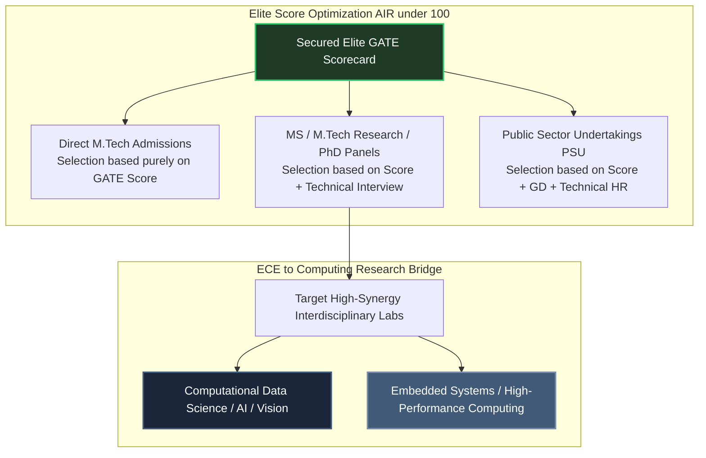

# Elite Post-GATE Career Outcomes: Research Panels & PSUs

Securing an **All India Rank (AIR) under 100** across **GATE DA and GATE CSE** opens highly coveted, elite technical and research pathways. However, elite scores are simply initial shortlisting criteria. Final admission into tier-1 research panels (IISc Bangalore, IIT Bombay, IIT Madras) or elite Public Sector Undertakings (PSUs) requires converting exam-based problem solving into deep **architectural defense capability**.

---

## 🏛️ Post-GATE Optimization Pathways

---

## 🔬 Interdisciplinary Research Panels: Exploiting the ECE Profile

When facing IISc or old IIT interview panels for M.Tech (Research), M.S., or direct PhD admissions, professors actively test your **core foundations and analytical intuition** rather than peripheral syntax frameworks or surface-level definitions. 

As an ECE graduate applying to CSE/DA streams, your profile represents a highly compelling, powerful asset if framed correctly.

### High-Synergy Domain Matching:
1. **Computational Data Science & AI:** Frame your research interest around signal optimization, continuous probability density models, or statistical learning theory. Your deep background in continuous distributions aligns perfectly with advanced machine learning labs.
2. **High-Performance Computing & Systems Architecture:** Leverage your ECE digital circuit design courses to propose research in hardware-software co-design, GPU acceleration arrays, or memory layout abstractions.

### The Interview Defense Protocol:
- **Rule of Depth:** Interviewers will ask you to select exactly **two strong subjects**. Select **Linear Algebra** and **Data Structures** (or **Operating Systems**). 
- **Chalk & Board Execution:** You will be asked to derive formulas or trace tree pointers live on a physical board. Explain your mental steps out loud. If an optimal path is unclear, state your boundary assumptions clearly to invite professor guidance.

---

## 🏢 Public Sector Undertakings (PSUs) Integration

Elite PSUs (ONGC, POSOCO, IOCL, BARC) recruit directly through top GATE CSE score arrays. 

### Preparation Strategy for Technical Interviews:
- **Core Focus:** Re-ingest your **Layer 1 Short Notes** for Core Systems (Operating Systems, Computer Networks, DBMS). PSUs test enterprise system scaling, failure resilience, and security architectures.
- **B.Tech Project Defense:** Be prepared to defend your undergraduate ECE final-year project. Clearly explain how its physical or communication architecture maps to logical software implementations.

---

## 🛑 Critical System Traps

1. **Assuming High Rank Guarantees Interview Clearing:** An AIR under 50 guarantees interview shortlisting, but professors will reject top-ranked candidates who display pure rote memorization without underlying mathematical intuition. **Practice oral board derivations systematically post-exam.**
2. **Applying to Mismatched Silos:** Avoid applying to purely traditional compiler construction labs if your coding profile leans heavily toward data science structures. Exploit cross-domain synergy intersections to maximize conversion velocity.
