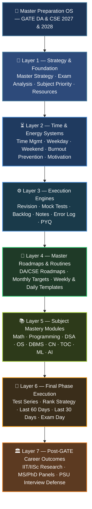

# Master Preparation Operating System: GATE DA & CSE (2027 & 2028)

Welcome to the **Master Preparation Operating System** custom-architected for securing an **All India Rank (AIR) under 100** across four distinct exam milestones:
1. **GATE Data Science & Artificial Intelligence (DA) 2027**
2. **GATE Computer Science & Information Technology (CSE) 2027**
3. **GATE Data Science & Artificial Intelligence (DA) 2028**
4. **GATE Computer Science & Information Technology (CSE) 2028**

This system is engineered specifically for an **Electronics and Communication Engineering (ECE) B.Tech graduate** transitioning into advanced computing, data systems, and machine learning architectures under strict weekday time constraints (**1 hour focused desk study + 2 hours passive travel study**).

---

## 🧭 System Architecture & Document Navigation

This repository functions as a modular, state-of-the-art preparation operating system. Every file is highly descriptive, actionable, and focused on maximum execution efficiency.

---

## 📁 Complete File Index

### 📌 Core Foundations & Strategy
- [00_master_strategy.md](./00_master_strategy.md): Dual-stream, dual-cycle integrated planning. Mindset shifts for transitioning from ECE to CSE/DA.
- [01_exam_analysis.md](./01_exam_analysis.md): Syllabus structures, mark distributions, cutoffs, and target accuracy metrics across DA and CSE papers.
- [02_subject_priority.md](./02_subject_priority.md): Dependency graph ordering, multi-phase sequencing, and return on investment (ROI) matrices.
- [14_tools_and_resources.md](./14_tools_and_resources.md): Global resource rules adhering to the strict **Book-First** policy. Offline digital pipelines for travel.

### ⏳ Time Management & Execution Systems
- [03_time_management_system.md](./03_time_management_system.md): Splitting focus effectively across tight weekly routines and managing cognitive loads.
- [04_weekday_strategy.md](./04_weekday_strategy.md): Optimization blueprint for **1-hour deep work** + **2-hour travel passive reading/revision**.
- [05_weekend_strategy.md](./05_weekend_strategy.md): Structuring **Saturday and Sunday full-day deep work blocks** with built-in active recall and recovery loops.
- [12_burnout_prevention.md](./12_burnout_prevention.md): Physical, neurological, and emotional recovery protocols to maintain multi-year stamina.
- [13_motivation_and_consistency.md](./13_motivation_and_consistency.md): Systems-driven consistency frameworks that outlast fluctuating motivation.

### ⚙️ The Preparation Engines
- [06_revision_system.md](./06_revision_system.md): Automated spaced repetition loops (1-7-21-30 days), active recall prompts, and continuous formula validation.
- [07_mock_test_strategy.md](./07_mock_test_strategy.md): Multi-tier test planning (topic, sectional, full-length) customized for first attempts vs. peak refinement attempts.
- [08_backlog_recovery.md](./08_backlog_recovery.md): Safety buffer integration, study debt compression, and catching up without schedule disruption.
- [09_note_making_system.md](./09_note_making_system.md): Layered note-making from comprehensive theory to ultra-short margin annotations and mistake logging.
- [10_error_log_system.md](./10_error_log_system.md): Root-cause tracking, defect categorization, and permanent conceptual patching.
- [11_pyq_strategy.md](./11_pyq_strategy.md): Leveraging Past Year Questions as real-time calibration and learning instruments from day one.

### 📅 Master Roadmaps & Micro-Templates
- [15_gate_da_2027_roadmap.md](./15_gate_da_2027_roadmap.md): The Foundation & First Serious Competitive Attempt lifecycle (May 2026 - Feb 2027).
- [16_gate_cse_2027_roadmap.md](./16_gate_cse_2027_roadmap.md): Parallel foundation alignment and test integration for GATE CSE 2027.
- [17_gate_da_2028_roadmap.md](./17_gate_da_2028_roadmap.md): Peak Performance & AIR <100 Optimization Strategy for DA in Year 2.
- [18_gate_cse_2028_roadmap.md](./18_gate_cse_2028_roadmap.md): The Ultimate Refinement and CS Core Abstraction Engine for CSE 2028.
- [19_monthly_targets_2026.md](./19_monthly_targets_2026.md): Month-by-month granular modules for May to December 2026.
- [20_monthly_targets_2027.md](./20_monthly_targets_2027.md): Month-by-month granular modules for January to December 2027.
- [21_monthly_targets_2028.md](./21_monthly_targets_2028.md): Final stretch modules for January and February 2028.
- [22_weekly_templates.md](./22_weekly_templates.md): Highly adaptable modular schedules for baseline and high-intensity weeks.
- [23_daily_templates.md](./23_daily_templates.md): Minute-by-minute execution routines for maximum productivity on weekdays and weekends.

### 📚 Subject-Specific Masteries
- [24_subjectwise_resources.md](./24_subjectwise_resources.md): Exhaustive textbook, written notes, and practice material index strictly adhering to the **Book-First** mandate.
- [25_math_for_da.md](./25_math_for_da.md): Exploiting ECE mathematical maturity in Linear Algebra, Probability, Calculus, and Statistics.
- [26_programming_foundation.md](./26_programming_foundation.md): Bridging procedural scripting to elite Python and C++ structures.
- [27_algorithms_mastery.md](./27_algorithms_mastery.md): Deep structural comprehension of asymptotic notations, greedy paradigms, DP, and graphs.
- [28_operating_systems.md](./28_operating_systems.md): Tackling concurrency, virtual memory layouts, and process synchronization from scratch.
- [29_dbms.md](./29_dbms.md): Relational algebra, robust SQL optimization, B+ Tree indexing, and transaction serializability proofs.
- [30_cn.md](./30_cn.md): Layered protocol stacks, flow control mechanisms, and dynamic routing architectures.
- [31_toc_and_compiler.md](./31_toc_and_compiler.md): Automata theory boundaries, lexical parsing tables, and syntax translations.
- [32_dsa_for_gate.md](./32_dsa_for_gate.md): Core structures, memory-layout mechanics, pointers, and stack frame analysis.
- [33_machine_learning_for_gate_da.md](./33_machine_learning_for_gate_da.md): Rigorous mathematical derivations, loss minimization, and core ML algorithms.
- [34_ai_and_data_science_strategy.md](./34_ai_and_data_science_strategy.md): Search heuristics, automated logic reasoning, and state spaces.

### 🏁 Final Phases & Career Outcomes
- [35_test_series_execution.md](./35_test_series_execution.md): Granular review workflows, attempt optimization, and mock test post-mortems.
- [36_rank_improvement_strategy.md](./36_rank_improvement_strategy.md): Eliminating conceptual leakage to transition from top-1000 to top-100 execution.
- [37_final_6_months_strategy.md](./37_final_6_months_strategy.md): The critical pivot to high-intensity test compounding and revision consolidation.
- [38_last_60_days_strategy.md](./38_last_60_days_strategy.md): Stamina building, defect tracking, and high-frequency formula sweeps.
- [39_last_30_days_strategy.md](./39_last_30_days_strategy.md): Schedule tapering, psychological conditioning, and offline short-note lockdowns.
- [40_exam_day_strategy.md](./40_exam_day_strategy.md): 180-minute absolute paper navigation, interface handling, and focus retention under stress.
- [41_interview_and_psu_options.md](./41_interview_and_psu_options.md): Leveraging elite GATE scores for direct admission to IIT/IISc Research programs (MS/PhD) and top-tier PSUs.

---

## 🎯 Core Operating Philosophy & Principles

### 1. Dual-Cycle Strategy (2027 vs. 2028)
- **GATE 2027:** Foundation and first serious competitive attempt. Focuses on system building, note creation, broad core concept mastery, and establishing baseline mock test reflexes.
- **GATE 2028:** AIR under 100 optimization attempt. Leverages established notes to perform high-frequency revisions, target deep problem solving, maximize speed and accuracy, and achieve peak rank potential.

### 2. The ECE Transition Advantage
Your mathematical maturity is your primary asset. Signal processing and communication systems give you an intuitive baseline for **Linear Algebra, Calculus, Probability, and Statistics**. The roadmap leverages this foundation to build maximum scoring confidence early, smoothing out the transition into pure computer science abstractions.

### 3. Book-First & Written-Media Dominance
We reject endless, low-retention video playlists. Standard textbooks, dense PDFs, handwritten notes, and active problem-solving sheets represent **>95% of your learning pipeline**. Video consumption is strictly reserved as an optional, high-ROI tool for highly complex conceptual bottlenecks.

### 4. Travel-Optimized Asynchronous Execution
With 2 hours of weekday travel time available, the system enforces a non-negotiable boundary: **No heavy cognitive lifting or coding during transit.** Commute hours are weaponized exclusively for low-energy maintenance: scanning spaced repetition reading sheets, inverse flashcards, formula notebooks, and mistake reviews.

### 5. Zero-Debt Adaptive Buffering
The pacing incorporates explicit buffers and monthly contingency blocks. If a week is lost due to professional work or sickness, it does not trigger cascading schedule failures; it enters a regulated debt compression queue handled systematically during designated weekend recovery zones.

---

## 🚀 Immediate Execution Workflow (Starting 12 May 2026)

1. **Read [00_master_strategy.md](./00_master_strategy.md)** to embed the overall multi-year philosophy.
2. **Review [02_subject_priority.md](./02_subject_priority.md)** to grasp the immediate subject-by-subject launching sequence.
3. **Set up your study schedules** using **[04_weekday_strategy.md](./04_weekday_strategy.md)** and **[05_weekend_strategy.md](./05_weekend_strategy.md)**.
4. **Launch into your active learning modules** defined in **[19_monthly_targets_2026.md](./19_monthly_targets_2026.md)**.

> [!IMPORTANT]
> Consistency compounds over intensity. Trust the structured operating system, preserve your revision loops, and systematically construct your path to an **AIR under 100**.
